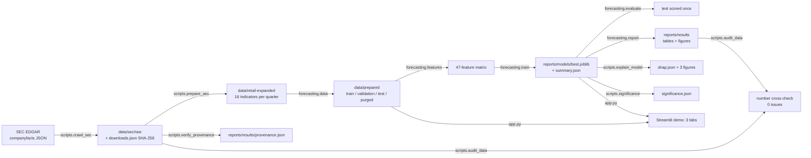

# Retail Financial Distress Prediction

Predicts whether a US retail chain will report financial distress in the next quarter, using SEC XBRL filings (10-K / 10-Q) and four scikit-learn model families.

**English (US) [Current]** · [繁體中文](README.zh-TW.md) · [Tiếng Việt](README.vi.md)

[](LICENSE)
[](https://github.com/ducy11/retail-financial-distress-prediction/actions/workflows/tests.yml)
[](https://github.com/ducy11/retail-financial-distress-prediction/releases)
[](https://www.python.org/)
[](https://scikit-learn.org/)
[](app.py)

The repository ships a frozen model, the full evaluation output, and the commands that regenerate both. Every number in `reports/` comes from an artifact on disk, and `python -m scripts.audit_data` matches those numbers against the SEC snapshots and the prepared splits.

## Demo

<!-- Placeholder image: drop a real capture at docs/preview.gif (the Streamlit demo or a terminal run). -->


Live demo: `https://<your-app>.streamlit.app` (deploy `app.py` on Streamlit Community Cloud; the app runs in simulation mode when `reports/models/best.joblib` is absent).

| Recorded on the shipped artifacts | Value |
|---|---|
| Selected model (highest cross-company AP) | `random_forest`, cross-company AP 0.958 |
| Operating threshold | 0.788 (cost matrix `5·FN + 1·FP`) |
| Test confusion at that threshold (n=64) | TP 36 · TN 25 · FN 2 · FP 1 |
| AUROC: in-domain vs cross-company vs leave-one-company-out | 0.983 · 0.933 · 0.628 |

## Key Features

- **Cell-level data provenance.** Every stored indicator is matched back to a `companyfacts` fact on tag, period, value and accession. `scripts/audit_data` re-runs that match over about 98,200 checks and reports 0 issues on the shipped data.
- **Leak-free evaluation by construction.** Splits are chronological inside each company with a purge band, model selection uses cross-company `GroupKFold`, and the test set (64 samples) is scored exactly once with a frozen model and threshold.
- **Deliberately small dependency surface.** The main pipeline uses numpy, scipy and scikit-learn only: no pandas, no gradient boosting, exactly four model families (Logistic Regression, Random Forest, HistGradientBoosting, MLP).
- **Self-contained KernelSHAP.** `forecasting/explain.py` implements KernelSHAP without the `shap` package and self-checks the efficiency identity `Σφ + E[f] = f(x)`; used for global ranking and per-sample explanations.
- **Statistical comparison layer.** DeLong's test and a paired bootstrap over the same test samples, plus walk-forward folds, leave-one-company-out and a company-cluster bootstrap for uncertainty that respects the panel structure.
- **Imbalance labs kept out of the main path.** Three separate labs at 95/5, 98/2 and 1:50 keep every sampler inside `imblearn.pipeline.Pipeline`, and the Focal Loss objective is verified against finite differences for both gradient and hessian.

## System Architecture



The same flow without a Mermaid renderer:

```
SEC companyfacts -> data/sec/raw -> data/retail-expanded -> data/prepared -> 47 features
                 -> train (select by cross-company AP) -> test scoring -> reports/ + Streamlit demo
```

## Tech Stack

| Layer | Choice | Version |
|---|---|---|
| Language | Python | 3.11+ (CI and development: 3.13) |
| Numerics | numpy, scipy | 2.5.3, 1.18.1 |
| Machine learning | scikit-learn | 1.6.0 |
| Figures | matplotlib | 3.9.3 |
| Web demo | Streamlit + plotly | `requirements-app.txt` |
| Imbalance labs (optional) | imbalanced-learn, LightGBM, XGBoost, pandas, tabulate | `requirements-labs.txt` |
| Tests | `unittest` (standard library, no pytest) | 245 cases |
| CI | GitHub Actions (`.github/workflows/tests.yml`) | Python 3.13 |
| Data source | SEC EDGAR `companyfacts` API (XBRL from 10-K / 10-Q) | public |

The main pipeline imports numpy, scipy and scikit-learn. `pandas` and the boosting libraries appear only inside `labs/`, which are standalone experiments.

## Quickstart

Requirements: Python 3.11 or newer, pip, and roughly 4 GB of RAM. Everything runs on CPU; the dataset is 324 company-quarters, so training finishes in seconds on a laptop. Internet access is needed only for `scripts.crawl_sec` and `scripts.fetch_events`.

```bash
git clone https://github.com/ducy11/retail-financial-distress-prediction.git
cd retail-financial-distress-prediction

python -m venv .venv
source .venv/bin/activate          # Windows: .venv\Scripts\activate
python -m pip install --upgrade pip
python -m pip install -r requirements.txt
```

Train, evaluate, then check the setup:

```bash
python -m forecasting.train        # fits 4 families, selects by cross-company AP -> reports/models/best.joblib
python -m forecasting.evaluate     # scores the test split once with the frozen model and threshold
python -m unittest discover -s tests -v
```

Regenerate every artifact in order (22 steps, log in `reports/results/run_all.log`):

```bash
python -m scripts.run_all
python -m scripts.run_all --only train,evaluate      # subset of steps
python -m scripts.run_all --skip search,explain      # everything except these
```

Rebuild the data from SEC (needs internet; `data/sec/raw` and `reports/models/*.joblib` are gitignored, so a fresh clone starts without them):

```bash
python -m scripts.crawl_sec        # snapshot companyfacts -> data/sec/raw + downloads.json
python -m scripts.prepare_sec      # port the 16-indicator ETL and back-check the table in use
python -m scripts.verify_provenance
python -m scripts.audit_data
```

Optional extras:

```bash
python -m pip install -r requirements-labs.txt   # imbalance labs (LightGBM / XGBoost / imbalanced-learn)
python -m labs.benchmark                         # 95/5 benchmark: Non-E Mode vs E-Mode
python -m labs.imbalance_lab.techniques          # 98/2 catalogue: 15 techniques + PR threshold tuning
python -m labs.imbalance_experiment.main         # 1:50 experiment: 17 pipelines, single vs hybrid

python -m pip install -r requirements-app.txt    # Streamlit demo
streamlit run app.py                             # http://localhost:8501
```

## Configuration / Environment Variables

The repository ships `.env.example` as a template. No dotenv loader is installed, so set the value in the process environment (or let your IDE or runner load the file for you):

```dotenv
# .env.example
#
# Optional: run every step against a different split folder, for example the rule-based
# labels written by `python -m scripts.relabel` into data/prepared-rule/.
FORECASTING_PREPARED_DIR=data/prepared-rule
```

```bash
# bash
export FORECASTING_PREPARED_DIR=data/prepared-rule
python -m scripts.run_all
```

```powershell
# PowerShell
$env:FORECASTING_PREPARED_DIR = "data/prepared-rule"
python -m scripts.run_all
```

| Variable | Required | Default | Purpose |
|---|---|---|---|
| `FORECASTING_PREPARED_DIR` | No | `data/prepared` | Split folder used by `forecasting.config.prepared_dir()`. Accepts a relative or absolute path; relative paths resolve against the working directory. |

The project needs no API keys or credentials. SEC asks for a real contact address in the `User-Agent` header, so replace the placeholder constant before crawling:

```python
# scripts/crawl_sec.py and scripts/fetch_events.py
USER_AGENT = "CS114-do-an research <student@example.edu>"
```

## Testing & Development

```bash
python -m unittest discover -s tests -v         # full suite: 245 cases
python -m unittest tests.test_pipeline -v       # one module
python -m unittest tests.test_app -v            # Streamlit demo (skips itself when streamlit is missing)

python -m scripts.audit_data                    # cross-check every reported number against artifacts
python -m compileall -q forecasting scripts labs tests   # syntax check

streamlit run app.py                            # hot reload: Streamlit reruns on save
```

What the suite locks down, beyond correctness of individual functions:

- the model registry stays at exactly four scikit-learn families, and `forecasting/models.py` contains no `import lightgbm` or `import xgboost` (`tests/test_preprocessing.py::TestModelRegistry`);
- resampling never reaches the main pipeline: no step exposes `fit_resample`, imputers and scalers learn their statistics from train only, and `class_weight="balanced*"` is resolved inside `fit` (`tests/test_pipeline.py::TestNoLeakageInPreprocessing`);
- the class ratio survives the split and the cross-validation folds (`tests/test_pipeline.py::TestSplits`);
- a deliberately leaky estimator is flagged, which proves the leak check can fail (`tests/test_benchmark_imbalanced.py`);
- `scripts.audit_data` catches corrupted labels, values, publication dates and provenance when it is handed a mutated copy (`tests/test_pipeline.py::TestDataAudit`).

`scripts.audit_data` skips the groups that need `data/sec/raw` or `reports/models/best.joblib`, so it runs clean on a fresh clone.

No linter or formatter is configured. CI runs `python -m unittest discover -s tests -v` and then `python -m scripts.audit_data` on every push and pull request, and that pair is the gate for merging.

## Project Structure

```
data/
  prepared/            train / validation / test / purged splits + manifest.json (policy, counts, hashes)
  retail-expanded/     16 indicators per company-quarter with per-cell provenance
  prepared-rule/       alternative split built from rule-based labels (optional)
  sec/raw/             SEC companyfacts snapshots (gitignored; python -m scripts.crawl_sec)
forecasting/           core package
  config.py            paths, seed, cost matrix, split-folder override
  data.py              rebuilds the splits from retail-expanded
  features.py          47-feature matrix (14 ratios, growth, path features)
  preprocessing.py     winsorize + median imputer + scaler, all fitted on train
  models.py            4 scikit-learn families and pipeline assembly
  train.py             fits, evaluates on validation, selects by cross-company AP
  evaluate.py          single frozen scoring run on test
  report.py            per-sample prediction table and score histogram
  explain.py           self-implemented KernelSHAP with an efficiency self-check
  validation.py        GroupKFold, leave-one-company-out, walk-forward, cluster bootstrap
  significance.py      DeLong test and paired bootstrap
  baselines.py         dummy, ticker prior, single feature, Altman Z''
  labels.py, eda.py, search.py, tuning.py, evaluation.py, data_loader.py
labs/                  imbalance experiments; extra dependencies, outside the main pipeline
  benchmark.py         95/5: Non-E Mode (resampling / cost-sensitive) vs E-Mode
  imbalance_lab/       98/2: 15-technique catalogue, Focal Loss, PR threshold tuning
  imbalance_experiment/ 1:50: 17 pipelines, single vs hybrid
scripts/               CLI entry points
  crawl_sec.py, prepare_sec.py, verify_provenance.py, audit_data.py
  eda.py, eda_deep.py, analyze.py, explain_model.py, significance.py, class_balance.py
  experiment_preprocessing.py, experiment_imbalance_real.py, experiment_defense.py
  label_sensitivity.py, relabel.py, search.py, predict.py, fetch_events.py
  run_all.py           runs all 22 steps and logs the outcome
  make_report.py, export_office.py, export_report_latex.py, make_uit_report.py
  probe_tags.py, probe_features.py   XBRL tag discovery helpers
app.py                 Streamlit demo, three tabs, reads artifacts directly
runtime_warnings.py    filters the two known harmless library warnings
tests/                 17 modules, 245 unittest cases
reports/
  results/             JSON/MD/CSV outputs, including data_audit.json and run_all.log
  figures/             figures grouped by topic (eda, analysis, shap, ...)
  models/              best.joblib (gitignored; recreate with python -m forecasting.train)
  experiment/, imbalance/   lab outputs
docs/                  report, model card, reproduction guide, per-topic documentation
```

## License & Credits

MIT License, Copyright (c) 2026 [ducy11](https://github.com/ducy11). See [LICENSE](LICENSE).

- Filings and XBRL facts come from the SEC EDGAR `companyfacts` API. The snapshots kept under `data/sec/raw` are derived from that public data; SHA-256 hashes and accession numbers for each used fact live in `data/sec/downloads.json` and in the per-cell provenance of `data/retail-expanded`.
- Monetary values are stored as VND integers for presentation, converted at a demo rate of 25,000 VND/USD. These are US filings, not Vietnamese financial statements.
- Built with scikit-learn, numpy, scipy, matplotlib, Streamlit, imbalanced-learn, LightGBM and XGBoost. Each library keeps its own license; the boosting libraries are used only by the labs.
- Course project for CS114.


