# Đồ án: Dự báo suy giảm tài chính (financial distress) doanh nghiệp bán lẻ

*Báo cáo sinh tự động từ `reports/results/*.json` bằng `python -m scripts.make_report`.*

## 1. Tóm tắt

**Bài toán.** Với dữ liệu báo cáo tài chính quý (SEC XBRL) của **8 chuỗi bán lẻ Mỹ**, dự báo cho quý kế tiếp liệu doanh nghiệp có rơi vào trạng thái suy giảm tài chính (`is_distressed`) hay không. Dữ liệu: **332 quý** → **324 mẫu** dự báo, chia train/validation/test = 212/32/64 (kèm dải purge chống rò rỉ theo ngày công bố).

**Phương pháp.** 47 feature tài chính (14 tỷ số ở dạng hiện tại + YoY, 10 tốc độ tăng trưởng, cấu trúc vốn, chỉ báo căng thẳng, cực trị/độ bền theo cửa sổ); pipeline `[winsorize] → median-impute → [scaler] → model` đặt trong `Pipeline` của scikit-learn; **4 họ mô hình** (Logistic Regression, Random Forest, HistGradientBoosting, **LightGBM**); đánh giá in-domain **và cross-company (GroupKFold/LOCO)**; chọn mô hình theo **AP cross-company** (quy tắc đầy đủ ở mục 5.2) rồi chốt trên test đúng một lần.

**Kết quả chính.**

- Mô hình được chọn: **Random Forest**, ngưỡng vận hành 0.788 → test **AUROC = 0.983**, **AP = 0.991**, precision/recall = 0.973/0.947, F1 = 0.960, macro-F1 = 0.952, Brier = 0.058.
- Khoảng tin cậy 95% (bootstrap) của AUROC test: [0.947, 1.000] trên n = 64 mẫu.
- **Phát hiện quan trọng:** baseline *không dùng mô hình* — lấy tỷ lệ nhãn trung bình của chính công ty trong train (`ticker_prior`) — đạt AUROC = 0.986, AP = 0.985, tức **bằng hoặc gần bằng mô hình học máy**. Khi chuyển sang đánh giá **cross-company** (giữ trọn công ty ra khỏi train), AUROC của mô hình còn **0.933** (in-domain: 0.983).
- Nhãn gần như là **thuộc tính của công ty**: HD, LOW, WMT có 100% nhãn = 1 trong mọi quý; mức khớp của nhãn với quy tắc kế toán đơn giản nhất chỉ 39%–65%.
- **Nguồn dữ liệu kiểm chứng được (không sinh/sửa tay):** 20 file companyfacts của SEC đã được băm SHA-256 và khớp registry `data/sec/downloads.json` (**0 lệch**); **4.609 ô** (quý × chỉ tiêu) tra ngược được trong companyfacts (kèm `accn`, `form`, ngày nộp) — **0 fact thiếu**, **0 ô bịa số**; 703 ô không có fact ở SEC được để `null`. Chi tiết: `reports/results/provenance.md`.

**Kết luận.** Vì baseline “nhớ mặt công ty” đạt xấp xỉ mô hình, AUROC ≈ 0,98 trong bảng kết quả thông thường **không** chứng minh năng lực dự báo suy giảm. Đóng góp trung thực của đồ án là chỉ ra rò rỉ thông tin ở cấp thực thể, định lượng nó, và đề xuất giao thức đánh giá đúng (cross-company + baseline + khoảng tin cậy). Phần truy vết nhãn ở `docs/dinh-nghia-nhan.md`.

## 2. Giới thiệu

### 2.1. Bối cảnh

Dự báo suy giảm tài chính là bài toán kinh điển của tài chính định lượng (Beaver 1966; Altman 1968) và đã được làm lại bằng học máy (Barboza, Kimura & Altman 2017; Mai et al. 2019). Với doanh nghiệp bán lẻ, tín hiệu sớm thường nằm ở biên lợi nhuận, vòng quay hàng tồn kho, cơ cấu nợ và dòng tiền hoạt động — đúng những chỉ tiêu có trong bộ dữ liệu này.

### 2.2. Câu hỏi nghiên cứu

| # | Câu hỏi | Trả lời ở mục |
|---|---|---|
| RQ1 | Ba họ mô hình (tuyến tính / bagging / boosting) khác nhau thế nào? | 6, 7 |
| RQ2 | Đặc trưng nào quyết định kết quả? Có đặc trưng chi phối bất thường? | 7.2, 7.3 |
| RQ3 | Mô hình có tổng quát hoá sang **công ty chưa từng thấy**? | 6.4, 8 |
| RQ4 | Kết luận có phụ thuộc vào **định nghĩa nhãn**? | 8.2 |

### 2.3. Đóng góp của đồ án

1. **Pipeline tái lập được**: `python -m scripts.run_all` chạy toàn bộ từ dữ liệu thô trong repo tới báo cáo; manifest có SHA-256 cho nguồn dữ liệu và cho từng split.
2. **Đo lường rò rỉ cấp thực thể** (điểm khác biệt so với cách làm thông thường): baseline ticker-prior, GroupKFold/LOCO, và hình kiểm chứng nhãn theo công ty × quý.
3. **Bộ đánh giá đầy đủ**: AUROC, AP/PR, precision/recall/F1, macro & weighted F1, MCC, confusion matrix, calibration + Brier, khoảng tin cậy bootstrap, ngưỡng theo F1 và theo chi phí kỳ vọng.
4. **Kiểm chứng độ nhạy theo định nghĩa nhãn** (`scripts.relabel`): dựng lại split bằng một quy tắc nhãn công khai, tái lập được, rồi so sánh kết luận.
5. **Phân tích lỗi có cấu trúc**: 6 mẫu sai trên test được truy vết tới công ty và chỉ tiêu cụ thể (`reports/results/error_cases.csv`).

### 2.4. Phạm vi và hạn chế đã biết

- 8 công ty / 324 mẫu → mọi kết luận kèm khoảng tin cậy, không suy rộng ra toàn ngành.
- Nhãn gốc không tái tạo được từ dữ liệu công bố (mục 8.1): hạn chế của **bộ dữ liệu**, đã được xử lý bằng kiểm chứng độ nhạy.
- Tiền tệ quy đổi minh hoạ (×25.000 VND/USD) để thống nhất đơn vị; không phải tỷ giá lịch sử.
- Chuỗi thời gian bị chồng lấn giữa các mẫu liên tiếp (cùng một quý xuất hiện trong nhiều cửa sổ lịch sử) → số quan sát **độc lập** thực tế nhỏ hơn 324.

## 3. Dữ liệu và phân tích khám phá (EDA)

### 3.1. Nguồn dữ liệu và cách tạo mẫu

Dữ liệu gốc là XBRL company-facts của SEC (`data/sec/`, có SHA-256 trong `data/sec/downloads.json`), được chuyển thành chuỗi 16 chỉ tiêu theo quý (`data/retail-expanded/`). Mỗi **mẫu** = (lịch sử các quý đã công bố trước `as_of`, quý target cần dự báo, nhãn `is_distressed`). Lịch sử **không** chứa quý target và mọi dòng lịch sử đều có `available_on <= as_of` (được kiểm thử tự động trong `tests/test_pipeline.py::test_no_label_leak_in_features`).

- Corpus: **8 công ty, 332 quý, 324 mẫu dự báo**, 16 chỉ tiêu.
- Độ dài lịch sử: min 1, median 21.0, max 47; **32/324 mẫu (9.9%)** có < 5 quý lịch sử → phần lớn feature YoY của các mẫu này là NaN và phải impute.

| Công ty | Số quý có dữ liệu |
|---|---:|
| DG | 32 |
| DKS | 44 |
| FIVE | 32 |
| HD | 44 |
| LOW | 44 |
| ORLY | 44 |
| ROST | 44 |
| WMT | 48 |

### 3.2. Cân bằng lớp và chất lượng nhãn

| Tập | Distress (1) | Không (0) | Tổng | Tỷ lệ dương |
|---|---:|---:|---:|---:|
| train | 132 | 80 | 212 | 62.3% |
| validation | 21 | 11 | 32 | 65.6% |
| test | 38 | 26 | 64 | 59.4% |
| purged | 11 | 5 | 16 | 68.8% |

- Nhãn là **nhị phân**, lớp dương chiếm đa số ở mọi tập → nếu chỉ báo cáo accuracy sẽ rất dễ ngộ nhận, vì vậy báo cáo dùng thêm macro/weighted F1, MCC và đường PR.
- **Kiểm tra mất cân bằng theo thực thể (điểm mấu chốt):** tỷ lệ nhãn = 1 theo từng công ty như sau — công ty HD/LOW/WMT có **100%** nhãn = 1 trong mọi quý, trong khi ROST chỉ ~5%. Nhãn vì thế gần như là thuộc tính của công ty chứ không phải sự kiện của quý.

| Công ty | Tỷ lệ nhãn = 1 |
|---|---:|
| HD | 1.00 |
| LOW | 1.00 |
| WMT | 1.00 |
| ORLY | 0.91 |
| DG | 0.55 |
| FIVE | 0.19 |
| DKS | 0.12 |
| ROST | 0.05 |


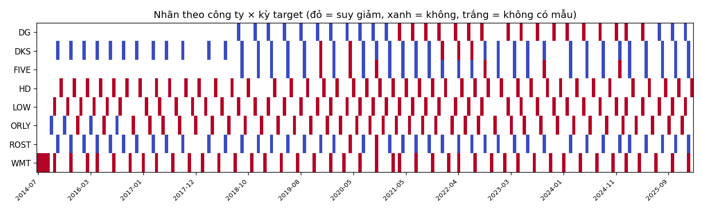

*Hình: Nhãn theo công ty × kỳ target — mỗi hàng gần như đồng màu ⇒ nhãn là thuộc tính thực thể*


### 3.3. Chất lượng dữ liệu: độ phủ chỉ tiêu

| Chỉ tiêu | Độ phủ thấp nhất theo công ty | Trung bình |
|---|---:|---:|
| liabilities | 0.0% | 3906.2% |
| receivables | 0.0% | 5710.2% |
| short_term_investments | 0.0% | 2954.5% |
| net_income | 909.1% | 8863.6% |
| operating_income | 909.1% | 8636.4% |
| operating_cash_flow | 5909.1% | 8970.2% |
| cash_and_equivalents | 8125.0% | 9765.6% |
| cost_of_sales | 10000.0% | 10000.0% |
| current_assets | 10000.0% | 10000.0% |
| current_liabilities | 10000.0% | 10000.0% |
| inventory | 10000.0% | 10000.0% |
| retained_earnings | 10000.0% | 10000.0% |
| revenue | 10000.0% | 10000.0% |
| selling_general_admin | 10000.0% | 10000.0% |
| stockholders_equity | 10000.0% | 10000.0% |
| total_assets | 10000.0% | 10000.0% |

- Các chỉ tiêu có độ phủ thấp ở một số công ty: **liabilities, receivables, short_term_investments, net_income, operating_income**. Hệ quả: các tỷ số dùng `receivables`/`short_term_investments` chỉ có nghĩa cho một phần mẫu; phần bị thiếu được `SimpleImputer(median)` xử lý **trong pipeline** (tránh rò rỉ thống kê từ validation/test) và có ablation riêng ở mục 7.3. Riêng tag `liabilities` có lỗ hổng đã được **khắc phục ở tầng feature**: `debt_to_assets` / `debt_to_equity` dùng `total_liabilities` = tag nếu có, ngược lại suy ra từ đẳng thức `total_assets - stockholders_equity` (xem mục 4.5).


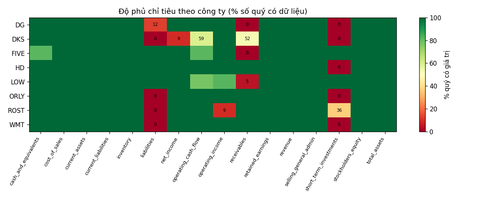

*Hình: Độ phủ chỉ tiêu theo công ty (% số quý có dữ liệu)*


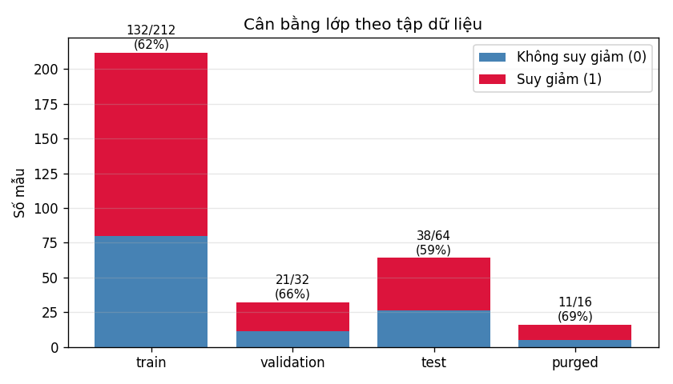

*Hình: Cân bằng lớp theo tập*


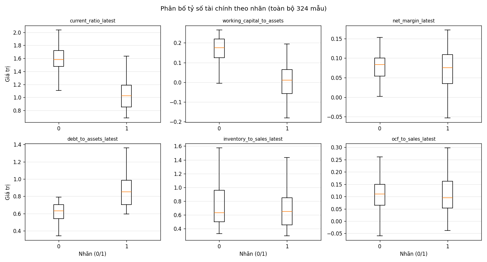

*Hình: Phân bố 6 tỷ số tài chính theo nhãn*


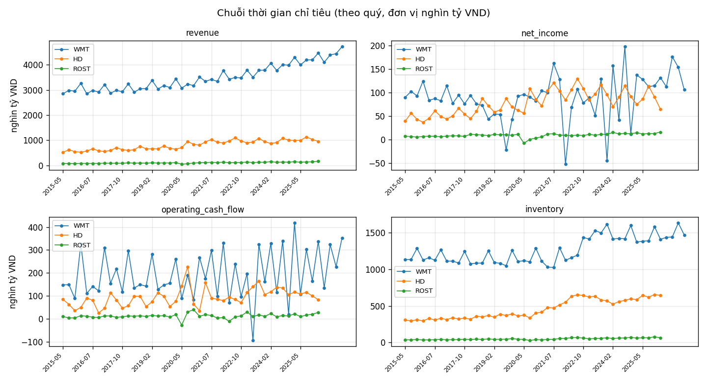

*Hình: Chuỗi thời gian 4 chỉ tiêu của WMT / HD / ROST*


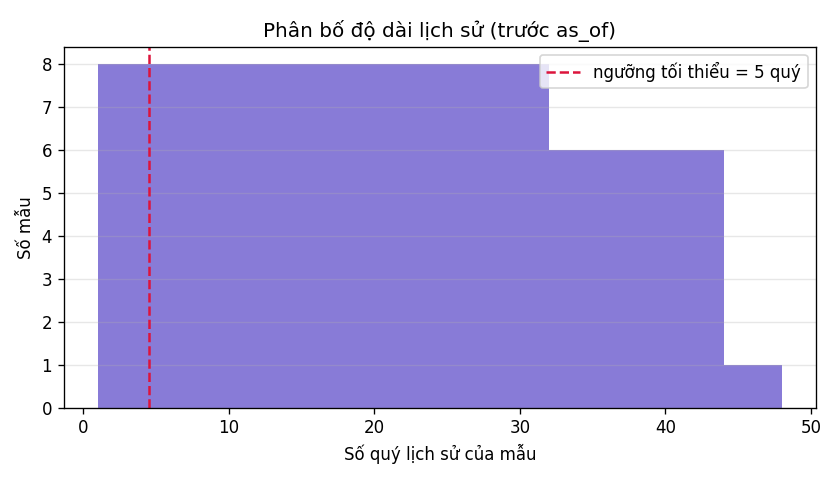

*Hình: Phân bố độ dài lịch sử; mẫu dưới ngưỡng 5 quý có nhiều feature YoY là NaN*


### 3.4. Thống kê mô tả và phân phối từng biến

- **14 tỷ số** được mô tả (giá trị quý gần nhất, không đơn vị) và **16 chỉ tiêu gốc** (nghìn tỷ VND, mọi công ty × mọi quý).
- Tỷ số lệch rõ (|skew| > 1): **6**; tỷ số có hơn 5% giá trị ngoại lai theo IQR: **4** — nặng nhất: debt_to_equity (30.6% ngoại lai), gross_margin (14.2% ngoại lai), cash_to_assets (8.3% ngoại lai).
- Tỷ số thiếu hơn 20% mẫu: **1** (receivables_to_sales 36.1%).

| Tỷ số | Thiếu % | Nhỏ nhất | Q1 | Trung vị | Trung bình | Q3 | Lớn nhất | Skew | Ngoại lai IQR % |
|---|---:|---:|---:|---:|---:|---:|---:|---:|---:|
| debt_to_equity | 0.0 | -1699.565 | 1.330 | 2.144 | -1.047 | 3.453 | 318.937 | -14.91 | 30.6 |
| gross_margin | 0.0 | -0.026 | 0.283 | 0.327 | 0.334 | 0.345 | 0.533 | 0.85 | 14.2 |
| cash_to_assets | 0.0 | 0.004 | 0.025 | 0.043 | 0.084 | 0.112 | 0.408 | 1.64 | 8.3 |
| retained_to_assets | 0.0 | -0.374 | 0.103 | 0.298 | 0.296 | 0.424 | 1.097 | 0.39 | 6.5 |
| quick_ratio | 0.0 | 0.082 | 0.188 | 0.276 | 0.421 | 0.591 | 1.744 | 1.42 | 4.6 |
| ocf_to_sales | 10.5 | -0.574 | 0.055 | 0.096 | 0.105 | 0.156 | 0.458 | -1.09 | 3.8 |
| sgna_pct_revenue | 0.0 | 0.114 | 0.187 | 0.215 | 0.223 | 0.246 | 0.461 | 0.81 | 3.1 |
| current_ratio | 0.0 | 0.687 | 0.968 | 1.192 | 1.259 | 1.552 | 2.979 | 0.87 | 1.2 |
| operating_margin | 14.8 | -0.359 | 0.052 | 0.098 | 0.105 | 0.150 | 0.238 | -1.17 | 0.7 |
| net_margin | 12.3 | -0.252 | 0.039 | 0.079 | 0.075 | 0.104 | 0.172 | -1.40 | 0.7 |
| inventory_to_sales | 0.0 | 0.298 | 0.478 | 0.645 | 0.718 | 0.885 | 1.829 | 0.80 | 0.6 |
| debt_to_assets | 0.0 | 0.342 | 0.633 | 0.724 | 0.777 | 0.939 | 1.360 | 0.70 | 0.0 |
| receivables_to_sales | 36.1 | 0.015 | 0.035 | 0.054 | 0.062 | 0.087 | 0.164 | 0.55 | 0.0 |
| revenue_per_asset | 0.0 | 0.104 | 0.316 | 0.418 | 0.427 | 0.539 | 0.711 | 0.10 | 0.0 |

*Diễn giải:* tỷ số vừa lệch vừa nhiều ngoại lai (thường là loại có mẫu số nhỏ như `debt_to_equity`) nên được **clip/winsorize** trước khi huấn luyện mô hình tuyến tính; cột `Thiếu %` càng lớn thì cột đó càng bị `SimpleImputer(median)` chi phối.

| Chỉ tiêu gốc (nghìn tỷ VND) | Thiếu % | Nhỏ nhất | Trung vị | Trung bình | Lớn nhất | Ngoại lai IQR % |
|---|---:|---:|---:|---:|---:|---:|
| short_term_investments | 72.3 | 0.000 | 4.100 | 5.490 | 46.300 | 3.3 |
| liabilities | 62.7 | 6.428 | 968.913 | 970.719 | 2353.950 | 0.0 |
| receivables | 38.3 | 0.949 | 9.376 | 60.128 | 302.875 | 0.0 |
| operating_income | 14.5 | -14.200 | 20.229 | 56.080 | 217.700 | 0.0 |
| net_income | 12.0 | -52.275 | 14.527 | 35.890 | 197.275 | 1.7 |
| operating_cash_flow | 10.2 | -93.950 | 18.968 | 57.591 | 417.800 | 6.7 |
| cash_and_equivalents | 1.8 | 0.663 | 34.699 | 75.780 | 571.150 | 6.1 |
| revenue | 0.0 | 5.022 | 163.331 | 734.852 | 4722.825 | 14.5 |
| cost_of_sales | 0.0 | 4.511 | 113.757 | 534.917 | 3590.375 | 14.5 |
| inventory | 0.0 | 5.384 | 121.412 | 335.267 | 1633.850 | 14.5 |
| selling_general_admin | 0.0 | 1.813 | 36.518 | 150.731 | 958.325 | 14.5 |
| total_assets | 0.0 | 18.376 | 424.372 | 1356.685 | 7216.375 | 14.5 |
| current_assets | 0.0 | 13.228 | 182.814 | 469.966 | 2323.000 | 14.5 |
| current_liabilities | 0.0 | 4.517 | 151.683 | 486.413 | 2893.300 | 14.5 |
| stockholders_equity | 0.0 | -378.675 | 66.055 | 327.756 | 2490.425 | 19.0 |
| retained_earnings | 0.0 | -393.600 | 72.066 | 524.231 | 2619.350 | 3.6 |

*Diễn giải:* chênh lệch **quy mô** giữa các công ty rất lớn (WMT lớn hơn FIVE nhiều lần) nên không so sánh giá trị tuyệt đối giữa công ty; mô hình dùng **tỷ số**. Các chỉ tiêu thiếu nhiều (short_term_investments 72%, liabilities 63%, receivables 38%) là hạn chế của dữ liệu gốc SEC.


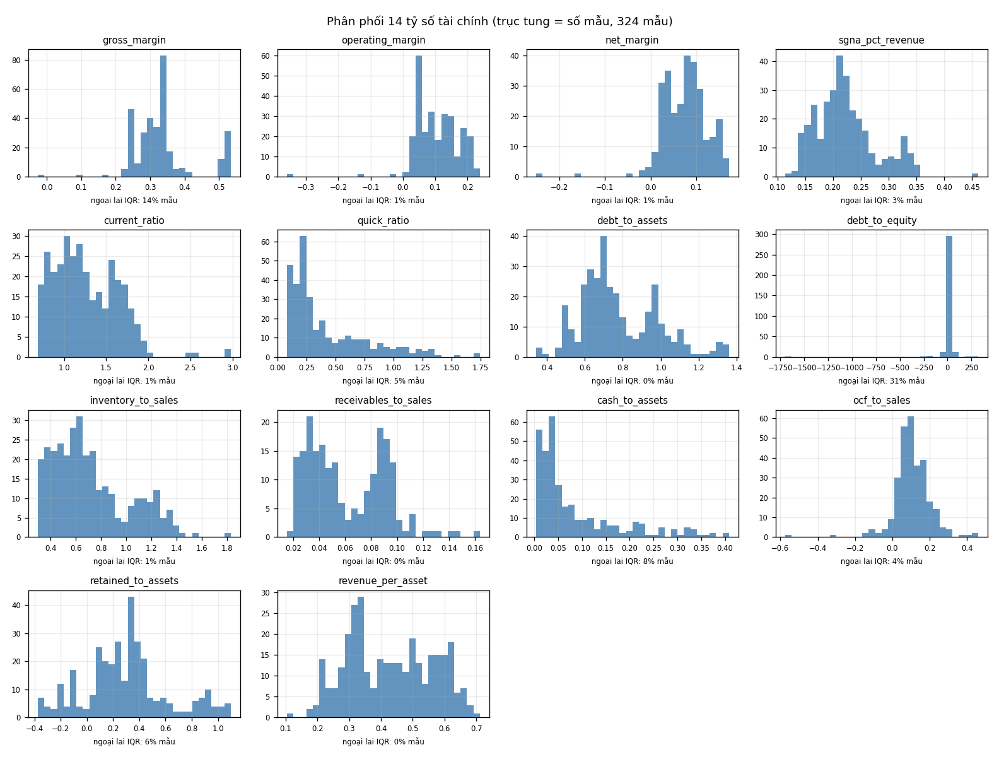

*Hình: Phân phối 14 tỷ số — mỗi ô ghi % mẫu ngoài khoảng IQR của tỷ số đó*


### 3.5. Tương quan giữa các biến và với nhãn

- **6 cặp tỷ số** có |r| ≥ 0.8 ⇒ gần như cùng một thông tin; gom thành **4 cụm**: cash_to_assets, current_ratio, quick_ratio; gross_margin, net_margin, operating_margin; debt_to_assets, receivables_to_sales.
- Số chiều hiệu dụng của 14 tỷ số: **5.083** (cần 9 thành phần cho 95% phương sai) ⇒ phần lớn cột là thông tin dư.
- **5 cặp** có tương quan Pearson lệch Spearman hơn 0,3 ⇒ tương quan chủ yếu do **ngoại lai**: debt_to_assets ↔ debt_to_equity (r -0.0752 vs hạng 0.4482), debt_to_equity ↔ receivables_to_sales (r -0.0382 vs hạng 0.385).

| Cặp tỷ số tương quan mạnh nhất | Pearson | Spearman |
|---|---:|---:|
| operating_margin ↔ net_margin | 0.978 | 0.973 |
| gross_margin ↔ operating_margin | 0.841 | 0.897 |
| quick_ratio ↔ cash_to_assets | 0.836 | 0.867 |
| sgna_pct_revenue ↔ inventory_to_sales | 0.833 | 0.748 |
| current_ratio ↔ quick_ratio | 0.821 | 0.747 |
| debt_to_assets ↔ receivables_to_sales | 0.803 | 0.736 |

| Tỷ số (tính trên train+validation) | AUC 1-tỷ số | Hướng | r (point-biserial) | q-value BH |
|---|---:|---|---:|---:|
| current_ratio | 0.074 | giá trị thấp ⇒ nhãn 1 | -0.688 | 0.0000 |
| debt_to_assets | 0.879 | giá trị cao ⇒ nhãn 1 | 0.623 | 0.0000 |
| receivables_to_sales | 0.867 | giá trị cao ⇒ nhãn 1 | 0.570 | 0.0000 |
| quick_ratio | 0.218 | giá trị thấp ⇒ nhãn 1 | -0.508 | 0.0000 |
| debt_to_equity | 0.715 | giá trị cao ⇒ nhãn 1 | -0.035 | 0.6809 |
| cash_to_assets | 0.337 | giá trị thấp ⇒ nhãn 1 | -0.398 | 0.0000 |
| gross_margin | 0.628 | giá trị cao ⇒ nhãn 1 | 0.212 | 0.0020 |
| operating_margin | 0.606 | giá trị cao ⇒ nhãn 1 | 0.212 | 0.0047 |

*Diễn giải:* các cặp |r| cao nên **giữ 1 đại diện mỗi cụm** hoặc dùng regularization; `|2·AUC−1|` cho biết tỷ số nào tự tách được hai lớp (hướng: giá trị cao hay thấp ứng với suy giảm) — nhưng nhóm thanh khoản/cấu trúc vốn gần như không đổi theo quý nên sức mạnh in-domain chủ yếu đến từ việc phân biệt **công ty**, không phải động lực suy giảm của từng quý.


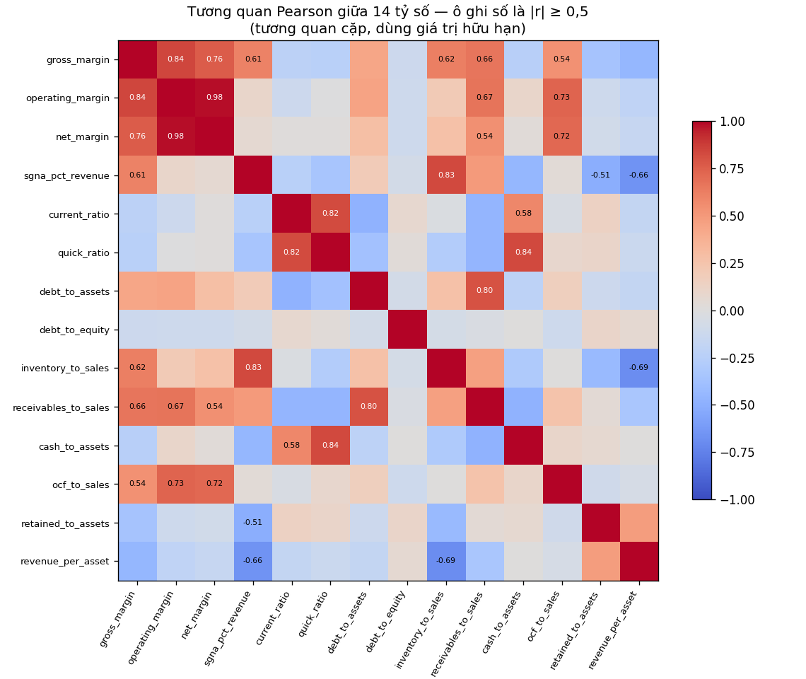

*Hình: Tương quan Pearson giữa 14 tỷ số (ô ghi số là |r| ≥ 0,5)*


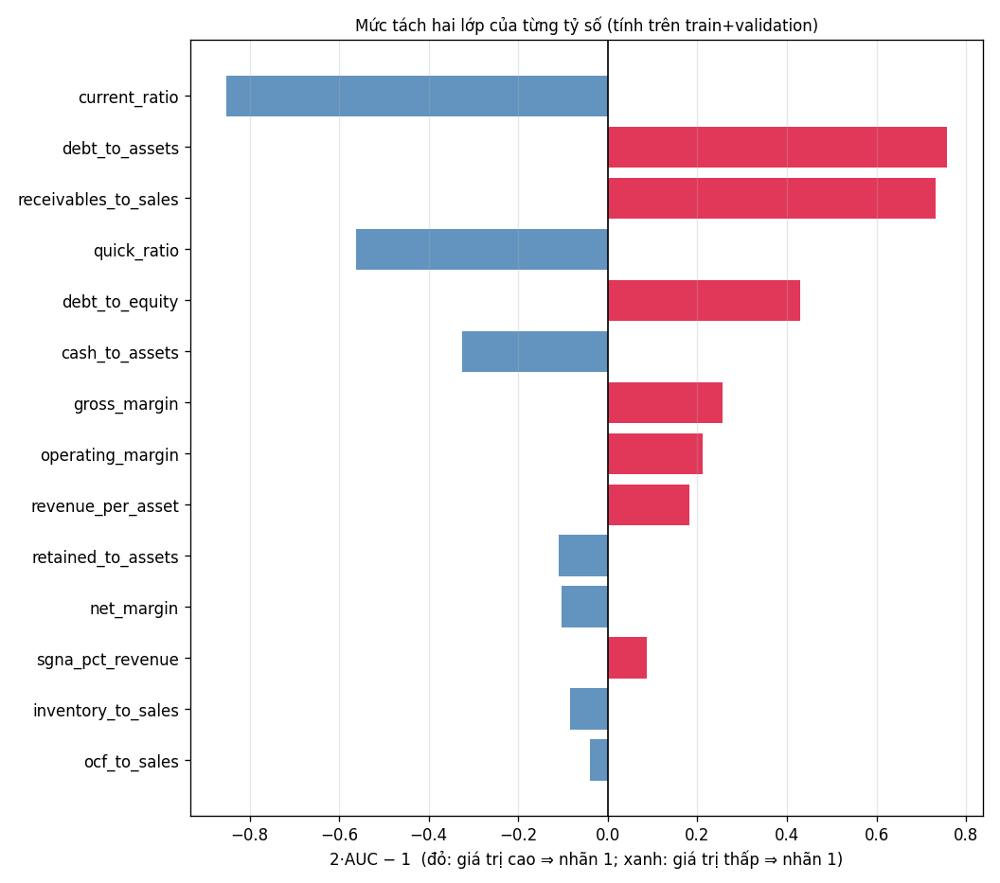

*Hình: Mức tách hai lớp của từng tỷ số (2·AUC − 1)*


### 3.6. Nhận xét EDA

1. Dữ liệu **đủ dài về thời gian** (tối đa 47 quý/công ty) nhưng **hẹp về số thực thể** (8 công ty) — đây là yếu tố giới hạn chính của bài toán.
2. Tỷ số tài chính có tính **bền theo công ty** (ví dụ `current_ratio`, `debt_to_assets` của cùng một công ty gần như không đổi qua các quý) ⇒ mô hình dễ học “danh tính công ty” thay vì học động lực suy giảm.
3. Chất lượng dữ liệu không đồng đều giữa các công ty (mục 3.3) → đã xử lý bằng impute trong pipeline + ablation.

**Nhận xét tự động sinh từ số liệu** (`reports/results/eda.md`, mục “Nhận xét”):

- **Phân phối & ngoại lai:** 6/14 tỷ số lệch rõ (|skew| > 1), lệch nhất: debt_to_equity (skew -14.91, max 318.94), cash_to_assets (skew 1.64, max 0.41), quick_ratio (skew 1.42, max 1.74); 4/14 tỷ số có hơn 5% giá trị ngoại lai theo IQR. ⇒ Trước khi huấn luyện nên **clip/winsorize** các tỷ số này (mô hình tuyến tính bị outlier kéo mạnh; mô hình cây ít bị hơn nhưng vẫn nên xem lại giá trị cực trị).
- **Giá trị thiếu (theo từng tỷ số):** 1 tỷ số thiếu hơn 20% — receivables_to_sales (36%). ⇒ Phần thiếu được `SimpleImputer(median)` xử lý **trong pipeline**; riêng các tỷ số dựa trên `receivables`/`short_term_investments` chỉ có nghĩa với một phần mẫu.
- **Tỉ lệ lớp (bằng %):** lớp suy giảm chiếm 62.3% toàn corpus; theo tập: train 62.3%, validation 65.6%, test 59.4%, purged 68.8%. ⇒ Chỉ đoán lớp đa số đã đạt 62.3% ⇒ **KHÔNG dùng Accuracy** làm thước đo chính; dùng Precision/Recall/**F1 & macro-F1**/PR-AUC (AP)/MCC và nêu ngưỡng quyết định.
- **Lệch lớp ở cấp công ty (quan trọng hơn cấp mẫu):** HD, LOW, WMT có **100% nhãn = 1** trong mọi quý; lệch ngược lại: DG chỉ 54.8% nhãn 1, FIVE chỉ 19.4% nhãn 1. ⇒ Nhãn gần như là thuộc tính của công ty, nên phải chia tập/CV **theo nhóm công ty** (GroupKFold/LOCO) và luôn so với baseline `ticker_prior`, nếu không AUROC in-domain sẽ bị thổi phồng.
- **Tương quan giữa các tỷ số:** 6 cặp có |r| ≥ 0.8 (gần như trùng thông tin), gom thành 4 cụm: cash_to_assets, current_ratio, quick_ratio; gross_margin, net_margin, operating_margin; debt_to_assets, receivables_to_sales. ⇒ Nên **giữ 1 đại diện mỗi cụm** hoặc dùng mô hình có regularization để tránh hệ số bất ổn.
- **Cảnh báo tương quan giả do ngoại lai:** 5 cặp có tương quan Pearson lệch xa Spearman hơn 0.30 — debt_to_assets↔debt_to_equity (r -0.0752 vs hạng 0.4482), debt_to_equity↔receivables_to_sales (r -0.0382 vs hạng 0.385), gross_margin↔debt_to_equity (r -0.1226 vs hạng 0.2693). ⇒ Các cặp này chỉ 'liên quan' ở vài quan sát dị biệt; phải xử lý ngoại lai trước khi kết luận về quan hệ giữa chúng.
- **Tỷ số tách hai lớp tốt nhất (train+validation, xếp theo |2·AUC−1|):** current_ratio (2·AUC−1 = -0.85 ⇒ giá trị thấp ⇒ nhãn 1), debt_to_assets (2·AUC−1 = +0.76 ⇒ giá trị cao ⇒ nhãn 1), receivables_to_sales (2·AUC−1 = +0.73 ⇒ giá trị cao ⇒ nhãn 1), quick_ratio (2·AUC−1 = -0.56 ⇒ giá trị thấp ⇒ nhãn 1), debt_to_equity (2·AUC−1 = +0.43 ⇒ giá trị cao ⇒ nhãn 1). ⇒ Đây là các biến nên giữ lại khi lọc đặc trưng; lưu ý nhóm thanh khoản/cấu trúc vốn gần như không đổi theo quý nên phần lớn sức mạnh dự báo in-domain đến từ việc phân biệt **công ty**, không phải từ động lực suy giảm của từng quý.
- **Ngoại lai ở dữ liệu gốc:** 10/16 chỉ tiêu tiền có hơn 5% quý nằm ngoài khoảng IQR — đây thường là khác biệt quy mô giữa các chuỗi bán lẻ (WMT lớn hơn FIVE nhiều lần), nên khi so sánh giữa công ty phải dùng **tỷ số** (đã có) thay vì giá trị tuyệt đối.

### 3.7. Kiểm tra chuyên sâu trước khi huấn luyện (`scripts.eda_deep`)

Mục 3.1–3.6 mô tả dữ liệu; mục này trả lời bốn câu hỏi kỹ thuật phải xong **trước khi tin vào metric**: (1) ma trận 47 feature có cột hằng / thiếu nhiều / đuôi nặng / nhiều outlier? (2) nhãn lệch và "dính" theo thời gian tới mức nào? (3) feature nào thật sự liên hệ với nhãn và nhóm feature nào trùng thông tin? (4) test có khác train và còn rò rỉ nào? Mọi số dưới đây đọc từ `reports/results/eda_deep.json` (không nhập tay).

**Chất lượng ma trận feature** (trên train+validation — test không dùng để mô tả liên hệ):

- Cột hằng số: **—**; gần hằng số (>95% một giá trị): **negative_ni_streak**.
- Thiếu > 20%: **8** cột — receivables_to_sales_yoy, receivables_to_sales_latest, operating_margin_yoy, operating_income_yoy_growth, ocf_to_sales_yoy, operating_cash_flow_yoy_growth, net_margin_yoy, net_income_yoy_growth.
- Đuôi nặng (|skew| > 5 hoặc kurtosis > 20): **15** cột, nặng nhất: debt_to_equity_latest, retained_to_assets_yoy, gross_margin_yoy, net_margin_yoy, net_income_yoy_growth.
- Nhiều outlier theo IQR (> 5% mẫu): **32** cột.
- Mật độ thiếu mỗi mẫu: trung bình 4.568/47 feature; 10.4% số mẫu thiếu quá nửa số feature.

| Chỉ số nhãn (toàn corpus) | Giá trị |
|---|---:|
| n mẫu | 324 |
| Tỉ lệ dương | 62.3% |
| Imbalance Ratio | 1.656 |
| Entropy (bit, tối đa 1.0) | 0.956 |
| Gini | 0.470 |
| Baseline đoán lớp đa số | 62.3% |
| Cặp quý liên tiếp giữ nguyên nhãn | 90.8% |
| P(nhãn 1 | quý trước nhãn 1) | 0.929 |
| P(nhãn 1 | quý trước nhãn 0) | 0.127 |
| Công ty chỉ có một lớp | HD, LOW, WMT |
| % mẫu thuộc công ty một lớp | 41.0% |
| Số thực thể hiệu dụng (1/Σp²) | 7.848 |

**Liên hệ feature ↔ nhãn** (xếp theo |2·AUC−1|, hiệu chỉnh đa so sánh bằng BH-FDR):

| Feature | #cặp | AUC 1-feature | Hướng | q-value BH | MI | Lift decile trên |
|---|---:|---:|---|---:|---:|---:|
| current_ratio_min_window | 244 | 0.048 | giá trị thấp ⇒ nhãn 1 | 0.0000 | 0.432 | 0.191 |
| current_ratio_latest | 244 | 0.074 | giá trị thấp ⇒ nhãn 1 | 0.0000 | 0.367 | 0.255 |
| working_capital_to_assets | 244 | 0.078 | giá trị thấp ⇒ nhãn 1 | 0.0000 | 0.336 | 0.128 |
| debt_to_assets_latest | 244 | 0.879 | giá trị cao ⇒ nhãn 1 | 0.0000 | 0.340 | 1.595 |
| receivables_to_sales_latest | 165 | 0.867 | giá trị cao ⇒ nhãn 1 | 0.0000 | 0.217 | 1.557 |
| quick_ratio_latest | 244 | 0.218 | giá trị thấp ⇒ nhãn 1 | 0.0000 | 0.172 | 0.255 |
| debt_to_equity_latest | 244 | 0.715 | giá trị cao ⇒ nhãn 1 | 0.8150 | 0.340 | 1.595 |
| retained_to_assets_yoy | 212 | 0.300 | giá trị thấp ⇒ nhãn 1 | 0.4427 | 0.153 | 0.551 |
| total_assets_yoy_growth | 212 | 0.315 | giá trị thấp ⇒ nhãn 1 | 0.0008 | 0.046 | 0.620 |
| cash_to_assets_latest | 244 | 0.337 | giá trị thấp ⇒ nhãn 1 | 0.0000 | 0.157 | 0.383 |

- 47/47 feature tính được AUC 1-feature; 11 feature có |2·AUC−1| ≥ 0.30; 11 feature còn ý nghĩa sau hiệu chỉnh. Điểm cần đọc kỹ: feature như `debt_to_equity_latest` có AUC cao nhưng `r` gần 0 và p-value lớn — hệ quả của đuôi cực nặng (outlier chi phối Pearson, không chi phối AUC).

**Đa cộng tuyến & số chiều hiệu dụng:**

- 8 cặp |r| ≥ 0.9; 15 feature nằm trong 7 cụm thông tin (mục 7.3 có thêm VIF).
- Số chiều hiệu dụng (participation ratio) = **12.892** trên 47 cột; cần 22 thành phần cho 95% phương sai ⇒ phần lớn cột là thông tin dư.

**Dịch chuyển phân phối train → test** (chẩn đoán, KHÔNG dùng để chọn mô hình):

| Feature | Mean train | Mean test | KS | SMD | PSI |
|---|---:|---:|---:|---:|---:|
| debt_to_assets_yoy | 0.067 | -0.026 | 0.621 | -0.928 | 5.615 |
| debt_to_equity_yoy | 0.060 | -0.160 | 0.561 | -0.115 | 5.398 |
| retained_to_assets_yoy | -0.646 | 0.086 | 0.398 | 0.176 | 1.821 |
| receivables_to_sales_latest | 0.057 | 0.079 | 0.327 | 0.656 | 4.050 |
| revenue_per_asset_latest | 0.445 | 0.386 | 0.325 | -0.456 | 2.567 |
| net_income_yoy_growth | 0.688 | 0.551 | 0.279 | -0.033 | 0.637 |

- 5 feature vượt ngưỡng cảnh báo (KS ≥ 0.30 hoặc |SMD| ≥ 0.50); 41 feature có PSI > 0.2 (PSI chia 10 khoảng trên 64 dòng test nên nhạy nhiễu — dùng cho monitoring về sau, không phải tiêu chí loại feature).

**Rò rỉ tiềm ẩn & tính độc lập của mẫu:**

- Jaccard lịch sử trung bình giữa hai mẫu liên tiếp cùng công ty = **0.917** (median 0.952) ⇒ 324 mẫu KHÔNG phải 324 quan sát độc lập.
- Dòng feature trùng khít test↔train: 0; số mẫu có nhãn công bố TRƯỚC khi kỳ target kết thúc: 0 (kỳ vọng 0 ⇒ PASS).

**Feature thiếu mang thông tin nhãn** (chi-square trên thiếu/có × nhãn, hiệu chỉnh BH-FDR):

| Feature | #thiếu | Tỉ lệ nhãn 1 khi thiếu | khi có dữ liệu | Δ (điểm %) | q-value BH |
|---|---:|---:|---:|---:|---:|
| net_margin_latest | 38 | 13.2% | 68.9% | -55.731 | 0.0000 |
| net_margin_min_window | 38 | 13.2% | 68.9% | -55.731 | 0.0000 |
| operating_margin_latest | 46 | 21.7% | 69.1% | -47.345 | 0.0000 |
| net_margin_yoy | 69 | 26.1% | 72.4% | -46.298 | 0.0000 |
| net_income_yoy_growth | 69 | 26.1% | 72.4% | -46.298 | 0.0000 |
| operating_margin_yoy | 77 | 29.9% | 72.7% | -42.857 | 0.0000 |

**Kết luận tự động:**

1. **Mức mất cân bằng (cấp mẫu):** entropy nhãn 0.955564 bit (tối đa 1.0), IR = 1.655738, lớp thiểu số 37.654321% ⇒ slightly_imbalanced; đoán lớp đa số đã đạt 62.345679% ⇒ không dùng Accuracy làm thước đo chính.
2. **Nhãn gần như là thuộc tính thực thể:** 90.822785% cặp quý liên tiếp giữ nguyên nhãn; P(nhãn=1 | quý trước nhãn=1) = 0.929293, P(nhãn=1 | quý trước nhãn=0) = 0.127119; 41.049383% mẫu thuộc công ty chỉ có MỘT lớp.
3. **Không được chia tập ngẫu nhiên theo mẫu:** công ty nhãn đơn lớp = HD, LOW, WMT ⇒ mọi đánh giá phải chia theo nhóm (`GroupKFold`/LOCO) và nêu IR theo công ty.
4. **Feature vô dụng/giả tín hiệu:** hằng số = —; gần hằng số (>95% một giá trị) = negative_ni_streak ⇒ cân nhắc loại.
5. **Feature bị impute chi phối** (thiếu > 20%): receivables_to_sales_yoy, receivables_to_sales_latest, operating_margin_yoy, operating_income_yoy_growth, ocf_to_sales_yoy, operating_cash_flow_yoy_growth, net_margin_yoy, net_income_yoy_growth ⇒ đọc kèm kiểm định missingness-mang-nhãn.
6. **Đuôi nặng/lệch mạnh** (|skew| > 5 hoặc kurtosis > 20): gross_margin_yoy, operating_margin_yoy, net_margin_yoy, debt_to_equity_latest, debt_to_equity_yoy, receivables_to_sales_yoy, cash_to_assets_yoy, ocf_to_sales_yoy, retained_to_assets_yoy, revenue_yoy_growth, cost_of_sales_yoy_growth, operating_cash_flow_yoy_growth ⇒ nên thêm winsorize/clip và dùng metric xếp hạng.
7. **Nhiều outlier theo IQR** (> 5% mẫu): gross_margin_latest, gross_margin_yoy, operating_margin_yoy, net_margin_yoy, sgna_pct_revenue_latest, sgna_pct_revenue_yoy, quick_ratio_latest, quick_ratio_yoy, debt_to_assets_yoy, debt_to_equity_latest, debt_to_equity_yoy, inventory_to_sales_yoy.
8. **Liên hệ feature ↔ nhãn:** 47/47 feature đủ mẫu để tính AUC 1-feature; 11 feature có |2·AUC−1| ≥ 0.30; 11 feature còn ý nghĩa sau BH-FDR.
9. **Đa cộng tuyến:** 8 cặp |r| ≥ 0.9, gom thành 7 cụm; số chiều hiệu dụng = 12.891743 (trên 47 cột).
10. **Dịch chuyển train → test:** 5 feature vượt ngưỡng (KS ≥ 0.3 hoặc |SMD| ≥ 0.5), 41 feature có PSI > 0.2.
11. **Mẫu không độc lập:** Jaccard lịch sử trung bình giữa hai mẫu liên tiếp cùng công ty = 0.916954 ⇒ số quan sát độc lập nhỏ hơn số mẫu; 0 dòng test trùng khít feature với train.
12. **Kiểm tra thứ tự nhãn:** 0 mẫu có `label_available_on` ≤ ngày kết thúc kỳ target (kỳ vọng 0); khoảng cách trung vị 34 ngày.
13. **Missingness:** 22 feature có tỉ lệ nhãn khác biệt có ý nghĩa giữa nhóm thiếu và nhóm có dữ liệu (BH-FDR < 5%) ⇒ dữ liệu thiếu theo cơ chế MNAR, median-impute một mình sẽ xoá tín hiệu; đề xuất thêm cờ `is_missing` khi tái huấn luyện.


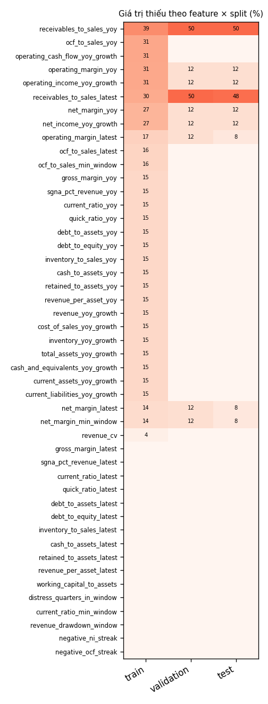

*Hình: Giá trị thiếu theo feature × split — cột nào bị impute chi phối*


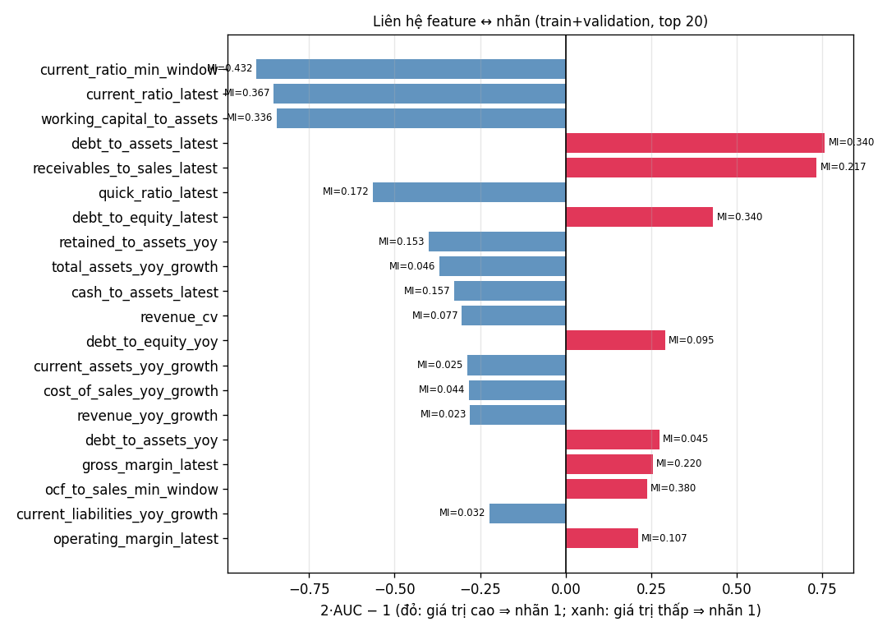

*Hình: Liên hệ feature ↔ nhãn: 2·AUC−1 kèm mutual information*


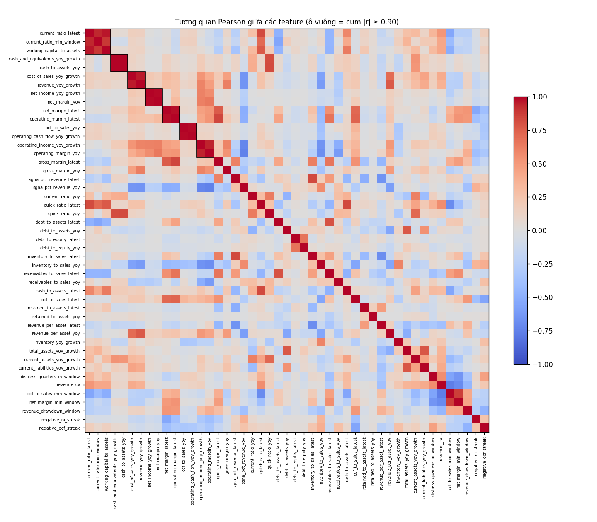

*Hình: Tương quan Pearson các feature, sắp theo cụm |r| ≥ 0.90*


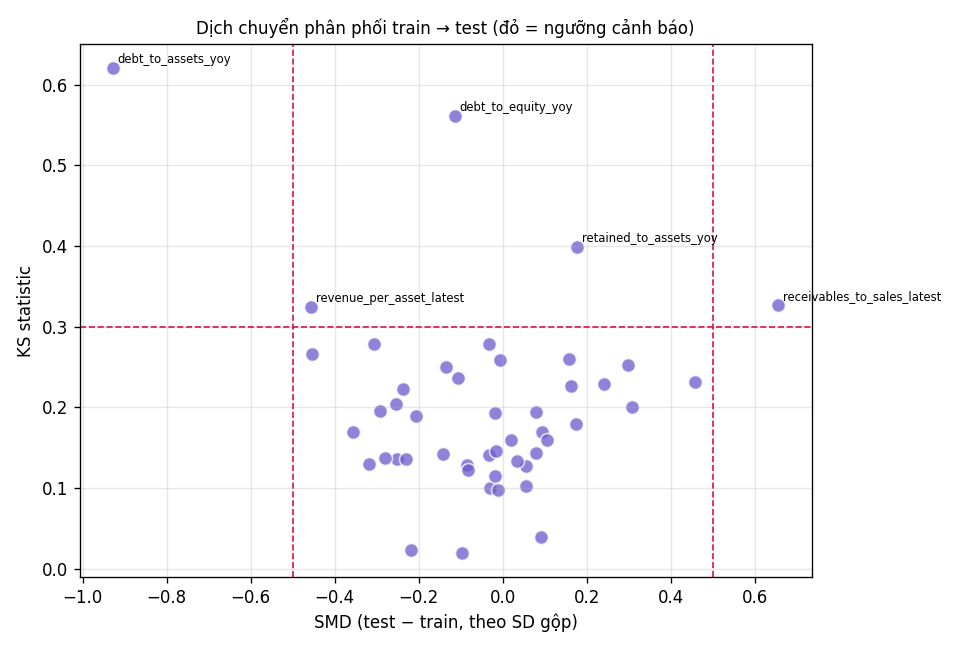

*Hình: Dịch chuyển train → test: KS vs SMD (đỏ = ngưỡng cảnh báo)*


## 4. Tiền xử lý dữ liệu và xây dựng đặc trưng

### 4.1. Sơ đồ pipeline

```
JSON thô (SEC XBRL) → 16 chỉ tiêu/quý → mẫu (lịch sử + quý target + nhãn)
   → 47 feature (tỷ số, YoY, tăng trưởng, cấu trúc vốn, chỉ báo căng thẳng,
     cực trị/độ bền theo cửa sổ) + nợ suy ra từ A = L + E
   → Pipeline(SimpleImputer(median) → [StandardScaler] → Model)
```

Cửa sổ lịch sử: **8 quý gần nhất** trước `as_of` (2 năm tài chính). Ngưỡng tối thiểu để feature YoY có nghĩa: **5 quý** (YoY cần 5 quý); 32 mẫu dưới ngưỡng vẫn được giữ lại (để không mất dữ liệu giai đoạn đầu của mỗi công ty) nhưng ảnh hưởng của chúng được đo bằng ablation ở mục 4.5.

### 4.2. Xử lý giá trị thiếu

- Giá trị thiếu trong JSON là `null` → `NaN` (`forecasting.data_loader.to_float`).
- **Impute bằng median đặt trong `Pipeline`** nên median chỉ được tính trên train của mỗi lần fit → không rò rỉ thống kê từ validation/test (lỗi rất thường gặp khi impute trước khi chia tập).
- Chỉ tiêu có độ phủ thấp (liabilities, receivables, short_term_investments…) làm cho các tỷ số liên quan bị impute tới ~65% giá trị → mục 4.5 đo ảnh hưởng bằng cách **bỏ hẳn** những cột có độ phủ < 50%.

### 4.3. Chuẩn hoá và mã hoá

- `StandardScaler` chỉ dùng cho Logistic Regression (mô hình tuyến tính); mô hình cây giữ nguyên đơn vị. Scaler cũng nằm **trong** Pipeline → không rò rỉ.
- Không có biến phân loại nào cần encode (nhãn nhị phân). **Cố ý không đưa `ticker` one-hot** vào mô hình: làm vậy sẽ biến bài toán thành bài toán nhận diện công ty và hợp thức hoá đúng cái rò rỉ đang được đo ở mục 6.4/8.

### 4.4. Nhiễu và outlier

- Chưa áp dụng winsorize/clip cho tỷ số: hệ thống báo cáo trung thực rằng đây là hạng mục còn thiếu (xem mục 9.2). `_safe_ratio` chỉ chặn chia cho 0.
- Nhiễu theo mùa vụ bán lẻ được xử lý gián tiếp bằng đặc trưng **YoY** (so cùng quý năm trước) thay vì so quý liền trước — đây là lựa chọn thiết kế có chủ đích.

### 4.5. Bộ đặc trưng

**Nhóm đặc trưng (47 cột):**

| Nhóm feature | Số cột | Ví dụ |
|---|---:|---|
| ratios_latest | 14 | `gross_margin_latest`, `operating_margin_latest`, `net_margin_latest`… |
| ratios_yoy | 14 | `gross_margin_yoy`, `operating_margin_yoy`, `net_margin_yoy`… |
| growth | 10 | `revenue_yoy_growth`, `cost_of_sales_yoy_growth`, `inventory_yoy_growth`… |
| structure | 1 | `working_capital_to_assets` |
| stress | 2 | `distress_quarters_in_window`, `revenue_cv` |
| path | 6 | `current_ratio_min_window`, `ocf_to_sales_min_window`, `net_margin_min_window`… |

**14 tỷ số** (mỗi tỷ số lấy giá trị quý gần nhất và YoY):

| Tỷ số | Công thức |
|---|---|
| gross_margin | `(revenue - cost_of_sales) / revenue` |
| operating_margin | `operating_income / revenue` |
| net_margin | `net_income / revenue` |
| sgna_pct_revenue | `selling_general_admin / revenue` |
| current_ratio | `current_assets / current_liabilities` |
| quick_ratio | `(current_assets - inventory) / current_liabilities` |
| debt_to_assets | `total_liabilities / total_assets` |
| debt_to_equity | `total_liabilities / stockholders_equity` |
| inventory_to_sales | `inventory / revenue` |
| receivables_to_sales | `receivables / revenue` |
| cash_to_assets | `cash_and_equivalents / total_assets` |
| ocf_to_sales | `operating_cash_flow / revenue` |
| retained_to_assets | `retained_earnings / total_assets` |
| revenue_per_asset | `revenue / total_assets` |

Ngoài ra: YoY của 10 chỉ tiêu chính, `working_capital_to_assets`, `distress_quarters_in_window` (số quý có dòng tiền hoạt động âm trong cửa sổ) và `revenue_cv` (hệ số biến thiên doanh thu).

**Nhóm `path` (6 cột)** — đặc trưng *đường đi* trong cửa sổ 8 quý (vì `*_latest` chỉ nhìn 1 quý, còn suy giảm tài chính là một quá trình): `current_ratio_min_window`, `ocf_to_sales_min_window`, `net_margin_min_window`, `revenue_drawdown_window`, `negative_ni_streak`, `negative_ocf_streak` — cực trị xấu nhất của current ratio / OCF-to-sales / net margin, mức giảm doanh thu so với đỉnh 8 quý, và số quý âm LIÊN TIẾP của net income / OCF. Nhóm này được đo trước khi đưa vào (`scripts/probe_features.py`, cross-company GroupKFold: +0,03…0,12 AUROC so với baseline).

**Chỉ tiêu thiếu phủ được xử lý ở tầng feature:** `total_liabilities` = tag `liabilities` nếu quý đó có, ngược lại suy ra từ đẳng thức kế toán `total_assets - stockholders_equity` (tag `liabilities` chỉ phủ ~39% số quý, còn 2 chỉ tiêu kia phủ 100%) ⇒ `debt_to_assets` / `debt_to_equity` có giá trị ở mọi mẫu. Đối chiếu 124 quý có tag: `scripts/audit_data.py`.

Danh sách đầy đủ: `forecasting/features.py` (`feature_names()` — 47 cột).

**Ablation (bỏ từng nhóm, mô hình Logistic, cùng split):**

| Biến thể | #feature | Val AUROC | Test AUROC | Test F1 |
|---|---:|---:|---:|---:|
| tất cả feature | 47 | 0.965 | 0.983 | 0.935 |
| bỏ nhóm ratios_latest (14 cột) | 33 | 1.000 | 0.933 | 0.914 |
| bỏ nhóm ratios_yoy (14 cột) | 33 | 0.961 | 0.984 | 0.949 |
| bỏ nhóm growth (10 cột) | 37 | 0.970 | 0.983 | 0.892 |
| bỏ nhóm structure (1 cột) | 46 | 0.961 | 0.984 | 0.935 |
| bỏ nhóm stress (2 cột) | 45 | 0.961 | 0.983 | 0.935 |
| bỏ nhóm path (6 cột) | 41 | 0.957 | 0.980 | 0.949 |
| bỏ cột độ phủ <50% (0 cột) | 47 | 0.965 | 0.983 | 0.935 |
| chỉ mẫu có ≥5 quý lịch sử | 47 | 0.965 | 0.984 | 0.935 |

### 4.6. Chống rò rỉ dữ liệu (checklist)

| Lớp chống rò rỉ | Cách làm | Kiểm chứng |
|---|---|---|
| Thời gian | Feature chỉ tính từ lịch sử có `available_on <= as_of` | test tự động `test_no_label_leak_in_features` |
| Chia tập | Theo thời gian trong từng công ty: 8 quý cuối = test, 4 quý = validation | `forecasting/data.py::split_policy` |
| Chia tập — stratified (Yêu cầu 1) | Tỉ lệ lớp của train/validation/test giữ trong sai số nhỏ (đo được: lệch ≤ 3,6 điểm %); CV dùng `StratifiedGroupKFold` (giữ tỉ lệ lớp VÀ giữ trọn công ty ngoài fold-train) | test tự động `test_class_ratio_preserved_across_splits`, `test_cv_folds_are_stratified_and_grouped` |
| Purge | Bỏ 1 quý sát trước và 1 quý sát sau validation ở mỗi công ty | `purged.json` (16 mẫu) |
| Tiền xử lý | Impute/scale nằm trong Pipeline, chỉ fit trên train | `forecasting/models.py` |
| Cân bằng lớp — balancing (Yêu cầu 2) | Pipeline chính KHÔNG resample; `class_weight='balanced*'` do sklearn tính trong `fit` từ nhãn nhận được. SMOTE / RandomUnderSampler chỉ tồn tại trong `imbalance_lab/` và `benchmark_imbalanced.py`, đặt TRONG `imblearn.pipeline.Pipeline` ⇒ chỉ chạy trên train (fold-train khi CV), validation/test không bao giờ bị resample | test tự động `test_main_pipeline_has_no_balancer`, `test_balancing_weights_come_from_fit_labels_only`; `tests/test_imbalance_lab.py`, `tests/test_benchmark_imbalanced.py` |
| Danh mục kỹ thuật (Yêu cầu 2) | 15 kỹ thuật thuộc 5 nhóm (cộng `baseline` chưa xử lý làm mốc so sánh) — oversampling (ROS/SMOTE/BorderlineSMOTE/ADASYN), undersampling (RUS/TomekLinks/ENN), hybrid (SMOTE+Tomek, SMOTE+ENN), algorithm-level (`scale_pos_weight`, `class_weight='balanced'`, **Focal Loss**) và ensemble (BalancedRF/EasyEnsemble/RUSBoost) — kèm **threshold tuning trên đường Precision-Recall** của xác suất out-of-fold; `python -m imbalance_lab.techniques` | `reports/imbalance/techniques.md` (PASS/FAIL chống rò rỉ cho từng kỹ thuật), `tests/test_imbalance_techniques.py`, `docs/cac-ky-thuat-mat-can-bang.md` |
| Đánh giá mô hình (Yêu cầu 3) | **Accuracy KHÔNG dùng làm thước đo chính** (chỉ in kèm mốc "đoán lớp đa số"); metric chính: Precision, Recall, F1 (binary/macro/weighted/**F-beta**), **PR-AUC (Average Precision)**, ROC-AUC, MCC + **Confusion Matrix**; resampling chỉ chạy TRONG `imblearn.pipeline.Pipeline`; có **bảng Baseline (chưa xử lý) vs từng kỹ thuật** kèm ΔPR-AUC/ΔF1/ΔF1-macro | `imbalance_lab/metrics.py` (`PRIMARY_METRICS`, `accuracy_diagnostic`), `tests/test_evaluation_metrics.py`, mục 3 + 4 của `reports/imbalance/techniques.md`, `reports/imbalance/techniques_comparison.csv` |
| Thực thể | Đo bằng ticker-prior + GroupKFold/LOCO (không dùng để huấn luyện) | mục 6.4, `reports/results/validation_checks.json` |

## 5. Mô hình và siêu tham số

### 5.1. Bốn họ mô hình

| Mô hình | Họ | Siêu tham số (cấu hình chạy chính) |
|---|---|---|
| Logistic Regression | Tuyến tính | `max_iter=2000`, `C=0.1` |
| Random Forest | Bagging (cây) | `n_estimators=300`, `max_depth=6`, `min_samples_leaf=2`, `class_weight=balanced_subsample`, `n_jobs=1` |
| HistGradientBoosting | Boosting (cây) | `max_iter=300`, `learning_rate=0.05`, `max_depth=3`, `l2_regularization=1.0`, `class_weight=balanced` |
| XGBoost *(tuỳ chọn)* | Boosting | Không chạy được trong môi trường này (xung đột phiên bản xgboost 2.1.3 ↔ scikit-learn 1.6.0: `'super' object has no attribute '__sklearn_tags__'`) → pipeline tự bỏ qua và ghi rõ trong log |

Registry có 5 mô hình chạy được; script tự bỏ mô hình nào lỗi ở môi trường hiện tại và ghi lý do vào log (`reports/results/run_all.log`). Như vậy yêu cầu “≥ 3 mô hình khác nhau” được đáp ứng bằng **tuyến tính + bagging + boosting**.

### 5.2. Quy trình chọn mô hình và ngưỡng

1. Fit cả 3 mô hình trên `train` (212 mẫu).
2. Tính metric in-domain trên `validation` (32 mẫu): AUROC, AP, F1 và đường PR → ngưỡng tối đa F1. **Đồng thời** tính **AP out-of-fold theo công ty** (GroupKFold trên train+validation, test không tham gia).
3. Chọn mô hình theo quy tắc tường minh: **max AP cross-company (GroupKFold, train+validation) → best-F1(val) → AP(val) → AUROC(val) → gap overfit nhỏ nhất** — vì metric in-domain bị chi phối bởi “nhớ mặt công ty” (mục 6.4), tiêu chí đầu tiên là khả năng tổng quát hoá sang công ty chưa từng thấy.

| Mô hình | AP cross-company | AUROC cross-company | best-F1(val) | AP(val) | AUROC(val) |
|---|---:|---:|---:|---:|---:|
| Logistic Regression | 0.923 | 0.890 | 0.976 | 0.987 | 0.965 |
| Random Forest | 0.958 | 0.943 | 0.976 | 0.987 | 0.965 |
| HistGradientBoosting | 0.957 | 0.940 | 0.976 | 0.989 | 0.974 |
| lightgbm | 0.947 | 0.933 | 0.976 | 0.987 | 0.965 |

4. Ngưỡng vận hành = ngưỡng best-F1 của mô hình được chọn trên validation (0.788); ngoài ra tính thêm ngưỡng tối ưu theo chi phí kỳ vọng (0.788, giả định FN đắt gấp 5 lần FP).
5. **Chốt trên test đúng một lần** với mô hình/ngưỡng đã cố định (`python -m forecasting.evaluate`), không tinh chỉnh gì thêm trên test.

### 5.3. Tinh chỉnh siêu tham số (CV chia theo công ty)

Dùng `GridSearchCV` với **StratifiedGroupKFold theo mã cổ phiếu**: mỗi fold giữ trọn một số công ty ra khỏi train. Nếu dùng CV thường (trộn mọi quý của mọi công ty) thì điểm CV sẽ bị thổi phồng đúng theo cơ chế rò rỉ thực thể phân tích ở mục 6.4. Metric để refit là **average precision (AP)** vì AP không phụ thuộc ngưỡng.

| Mô hình | Cấu hình tốt nhất (CV) | #cấu hình | CV-AP | CV-AUROC | CV-AP mặc định | Chênh lệch |
|---|---|---:|---:|---:|---:|---:|
| Logistic Regression | `{'C': 0.01, 'class_weight': None}` | 8 | 0.960 | 0.917 | 0.935 | 0.026 |
| Random Forest | `{'max_depth': 3, 'min_samples_leaf': 2, 'n_estimators': 500}` | 18 | 0.989 | 0.976 | 0.986 | 0.003 |
| HistGradientBoosting | `{'learning_rate': 0.03, 'max_depth': 2, 'max_iter': 200}` | 8 | 0.939 | 0.934 | 0.924 | 0.015 |
| lightgbm | `{'learning_rate': 0.05, 'min_child_samples': 10, 'num_leaves': 15}` | 12 | 0.917 | 0.888 | 0.917 | 0.000 |

Cột “CV-AP mặc định” là điểm của cấu hình trong `HYPERPARAMS` trên **cùng** splitter, để trả lời câu hỏi “tinh chỉnh có thật sự cải thiện hay không” thay vì chỉ nói rằng đã chạy GridSearch. Kết quả từng cấu hình: `reports/results/tuning.md`.

### 5.4. Sổ tay thực nghiệm (cấu hình đã chạy)

| Thành phần | Giá trị |
|---|---|
| Seed | 42 |
| Số feature | 47 |
| Chia tập | theo thời gian trong từng công ty + dải purge |
| Chọn mô hình | max AP cross-company (GroupKFold, train+validation) → best-F1(val) → AP(val) → AUROC(val) → gap overfit nhỏ nhất |
| Ngưỡng vận hành | 0.788 |
| Ngưỡng tối ưu chi phí | 0.788 |
| Chi phí giả định | FN = 5, FP = 1 (phân tích ở mục 7.6) |
| Bootstrap | 2.000 vòng cho AUROC/AP/F1 (mục 6.5) |

## 6. Kết quả và so sánh mô hình

### 6.1. Bảng so sánh định lượng (có baseline đối chứng)

| Hệ thống (test, threshold 0.5) | AUROC | AP | F1 | macro-F1 | Accuracy |
|---|---:|---:|---:|---:|---:|
| Dummy (lớp đa số) | 0.500 | 0.594 | 0.745 | 0.373 | 0.594 |
| Baseline “nhớ mặt công ty” (ticker-prior) | 0.986 | 0.985 | 0.914 | 0.905 | 0.906 |
| single_feature[debt_to_assets_latest] | 0.889 | 0.938 | 0.847 | 0.772 | 0.797 |
| model[logistic] | 0.983 | 0.989 | 0.935 | 0.919 | 0.922 |
| model[random_forest] | 0.983 | 0.991 | 0.949 | 0.934 | 0.938 |
| model[hist_gradient_boosting] | 0.977 | 0.987 | 0.937 | 0.917 | 0.922 |

Trong đó: `Dummy (lớp đa số)` = “không học gì”; `Baseline nhớ mặt công ty` (ticker-prior) chỉ dùng tỷ lệ nhãn trung bình của chính công ty đó trong train; `single_feature[debt_to_assets_latest]` là Logistic trên **một** chỉ tiêu duy nhất.

**Đọc bảng này:** baseline ticker-prior đạt AUROC/AP xấp xỉ mô hình học máy ⇒ phần lớn khả năng “phân biệt” đến từ việc nhận ra công ty, không phải từ động lực suy giảm của quý.

### 6.2. Metric đầy đủ tại từng ngưỡng (test n = 64)

| Ngưỡng | Accuracy | Precision | Recall | F1 | macro-F1 | FP | FN | Chi phí kỳ vọng (5·FN+FP) |
|---|---:|---:|---:|---:|---:|---:|---:|---:|
| 0.300 | 0.922 | 0.902 | 0.974 | 0.937 | 0.917 | 4 | 1 | 9.0 |
| 0.350 | 0.938 | 0.925 | 0.974 | 0.949 | 0.934 | 3 | 1 | 8.0 |
| 0.400 | 0.938 | 0.925 | 0.974 | 0.949 | 0.934 | 3 | 1 | 8.0 |
| 0.500 | 0.938 | 0.925 | 0.974 | 0.949 | 0.934 | 3 | 1 | 8.0 |
| 0.600 | 0.938 | 0.925 | 0.974 | 0.949 | 0.934 | 3 | 1 | 8.0 |
| 0.656 | 0.938 | 0.925 | 0.974 | 0.949 | 0.934 | 3 | 1 | 8.0 |
| **0.788 (vận hành)** | 0.953 | 0.973 | 0.947 | 0.960 | 0.952 | 1 | 2 | 11.0 |

- AUROC = **0.983**, AP = **0.991**, Brier = 0.058.
- Ngưỡng vận hành 0.788 cho precision 0.973 nhưng recall chỉ 0.947 (bỏ sót 2 mẫu suy giảm); ngưỡng tối ưu theo chi phí kỳ vọng là 0.783.
- Báo cáo cả hai ngưỡng cạnh nhau để thấy rõ **trade-off và cơ sở kinh tế** của quyết định, thay vì chốt 0,5 một cách tuỳ ý.

### 6.3. Confusion matrix, ROC/PR và phân phối xác suất


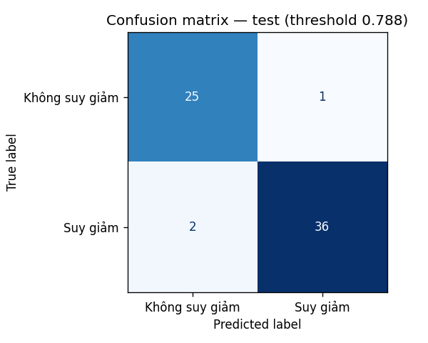

*Hình: Confusion matrix tại ngưỡng vận hành (đúng ngưỡng dùng để ra quyết định)*


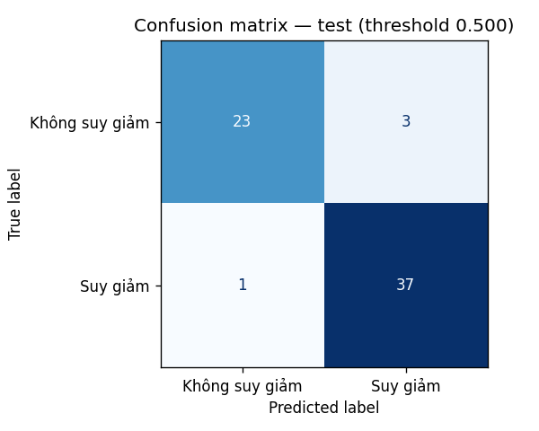

*Hình: Confusion matrix tại ngưỡng 0.5*


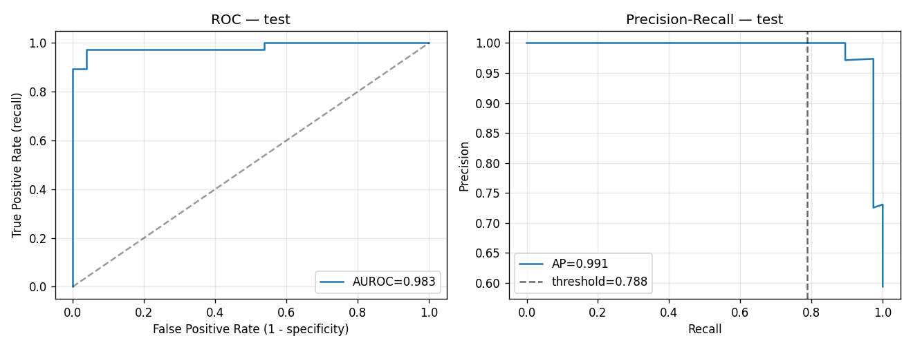

*Hình: ROC và Precision-Recall trên test*


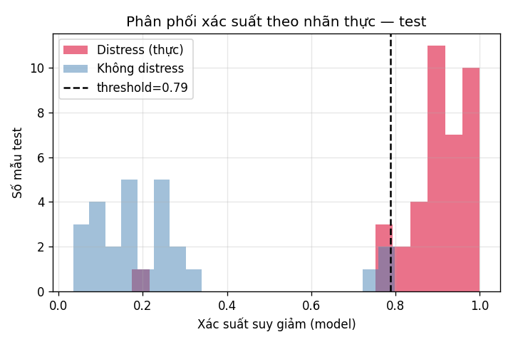

*Hình: Phân phối xác suất theo nhãn thực trên test*


### 6.4. Kiểm chứng tổng quát hoá: in-domain vs cross-company

| Mô hình | In-domain AUROC | In-domain AP | Cross-company AUROC | Cross-company AP | Cross-company F1 |
|---|---:|---:|---:|---:|---:|
| Logistic Regression | 0.983 | 0.989 | 0.912 | 0.942 | 0.883 |
| Random Forest | 0.983 | 0.991 | 0.933 | 0.957 | 0.938 |
| HistGradientBoosting | 0.977 | 0.987 | 0.926 | 0.953 | 0.825 |
| lightgbm | 0.979 | 0.988 | 0.933 | 0.957 | 0.878 |

- Cross-company = GroupKFold **theo công ty** trên toàn bộ 324 mẫu (mỗi fold giữ trọn một công ty ra ngoài) → đây là con số trung thực cho câu hỏi “công ty mới thì sao?”.
- LOCO (train 7 công ty, test công ty còn lại, chỉ dùng split theo thời gian): trung bình AUROC = **0.610** trên 8 công ty tính được. Các công ty **không tính được AUROC** (nhãn đơn lớp ở cả validation và test): —.
- Nhận xét: khi buộc phải tổng quát hoá sang công ty mới, mô hình gần như trở về mức “đoán theo xu hướng chung”, trong khi ở chế độ in-domain gần đạt mức hoàn hảo. Khoảng cách này chính là **định lượng của rò rỉ cấp thực thể**.


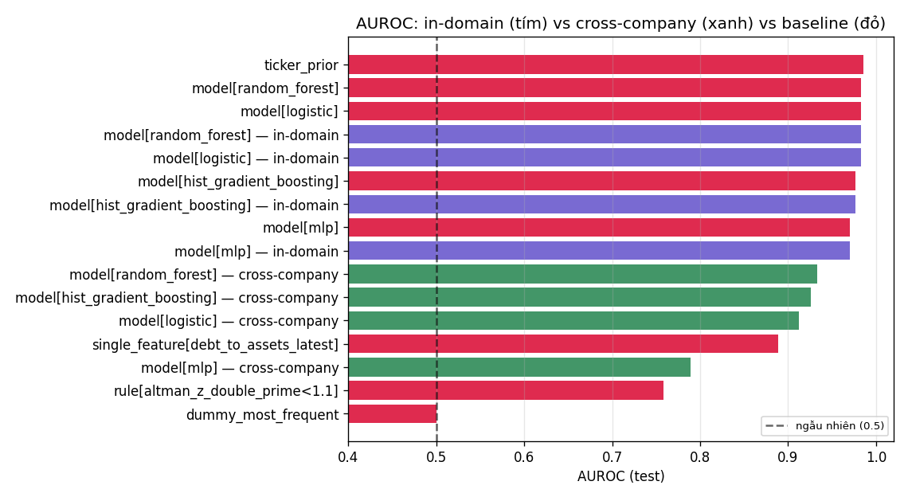

*Hình: AUROC: in-domain vs cross-company vs baseline*


### 6.5. Độ bất định của metric (bootstrap 2.000 vòng, test n = 64)

| Mô hình | AUROC | AUROC CI95 | AP | AP CI95 | F1 @0.5 |
|---|---:|---:|---:|---:|---:|
| Logistic Regression | 0.983 | 0.955–1.000 | 0.989 | 0.970–1.000 | 0.935 |
| Random Forest | 0.983 | 0.947–1.000 | 0.991 | 0.971–1.000 | 0.949 |
| HistGradientBoosting | 0.977 | 0.940–1.000 | 0.987 | 0.964–1.000 | 0.937 |
| lightgbm | 0.979 | 0.946–1.000 | 0.988 | 0.966–1.000 | 0.949 |

Với n = 64 mẫu test, khoảng tin cậy rộng là điều bình thường — báo cáo vì thế không nêu một con số AUROC đơn lẻ mà không kèm CI.

### 6.6. Vì sao mô hình này vượt mô hình kia?

| So sánh | Bằng chứng định lượng | Giải thích |
|---|---|---|
| Logistic vs Random Forest | AUROC train 0.984 vs 1.000; gap AUROC 0.019 vs 0.034 (bảng 7.1) | Cây chia được tới khi tách hoàn hảo tập train (212 mẫu, nhiều chiều) → gap dương; Logistic bị ràng buộc tuyến tính + L2 nên gap nhỏ nhất |
| Logistic vs HistGradientBoosting | Val AP 0.987 vs 0.989; gap AUROC HGB = 0.026 | Ba mô hình đồng hạng ở best-F1 trên validation; quy tắc chọn (mục 5.2) phân định theo **AP cross-company**, rồi mới tới best-F1/AP/AUROC trên validation |
| Mô hình vs baseline ticker-prior | AUROC test 0.983 (mô hình) vs 0.986 (ticker-prior, không dùng feature nào) | Baseline “nhớ mặt công ty” đạt mức tương đương (có lúc cao hơn) ⇒ phần lớn khả năng phân biệt in-domain đến từ việc nhận ra công ty |
| Mô hình vs dummy | macro-F1 ≈ 0.952 vs 0.37 (dummy) | Mô hình **có** học được tín hiệu phân biệt thật (không đoán mò); vấn đề là tín hiệu đó phần lớn mang tính thực thể |


## 7. Phân tích kết quả chuyên sâu

### 7.1. Overfitting / Underfitting (Train vs Validation)

| Mô hình | Train AUROC | Val AUROC | Gap AUROC | Train F1 | Val F1 | Gap F1 | Val AP | Brier |
|---|---:|---:|---:|---:|---:|---:|---:|---:|
| Logistic Regression | 0.984 | 0.965 | 0.019 | 0.935 | 0.976 | -0.040 | 0.987 | 0.051 |
| Random Forest | 1.000 | 0.965 | 0.034 | 0.985 | 0.976 | 0.009 | 0.987 | 0.046 |
| HistGradientBoosting | 1.000 | 0.974 | 0.026 | 1.000 | 0.976 | 0.024 | 0.989 | 0.037 |
| lightgbm | 1.000 | 0.965 | 0.035 | 1.000 | 0.976 | 0.024 | 0.987 | 0.035 |


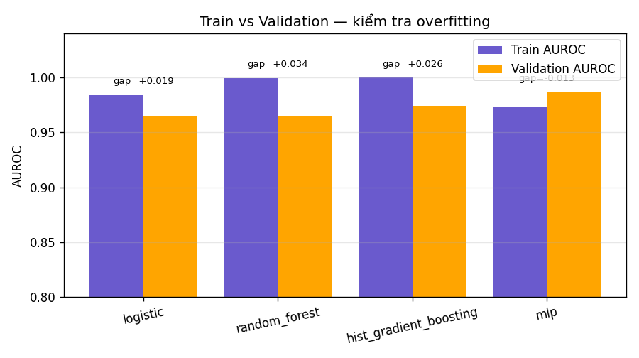

*Hình: Train vs Validation — gap càng lớn càng dễ overfit*


**Kết luận.** Gap AUROC train→validation theo từng mô hình: Logistic Regression = 0.019 (val F1 0.976); Random Forest = 0.034 (val F1 0.976); HistGradientBoosting = 0.026 (val F1 0.976); lightgbm = 0.035 (val F1 0.976). Mô hình cây phi tham số bám tập train sát hơn (gap dương) — hệ quả của 212 mẫu với 47 chiều. Mô hình được chốt là **Random Forest** theo quy tắc ở mục 5.2 (`max AP cross-company (GroupKFold, train+validation) → best-F1(val) → AP(val) → AUROC(val) → gap overfit nhỏ nhất`), không phải theo một mô hình định trước.

### 7.2. Đặc trưng ảnh hưởng nhiều nhất

| # | Feature | Val ΔAUROC | Test ΔAUROC | Hệ số Logistic |
|---:|---|---:|---:|---:|
| 1 | `debt_to_assets_latest` | 0.044 | 0.079 | 0.94 |
| 2 | `current_ratio_min_window` | 0.019 | 0.020 | -0.65 |
| 3 | `working_capital_to_assets` | 0.018 | 0.018 | -0.58 |
| 4 | `ocf_to_sales_yoy` | 0.005 | 0.000 | — |
| 5 | `revenue_cv` | 0.003 | — | — |
| 6 | `current_ratio_latest` | 0.003 | 0.009 | -0.47 |
| 7 | `receivables_to_sales_latest` | 0.003 | 0.001 | 0.26 |
| 8 | `revenue_drawdown_window` | 0.003 | — | -0.18 |
| 9 | `gross_margin_latest` | 0.002 | — | — |
| 10 | `current_ratio_yoy` | 0.000 | — | — |


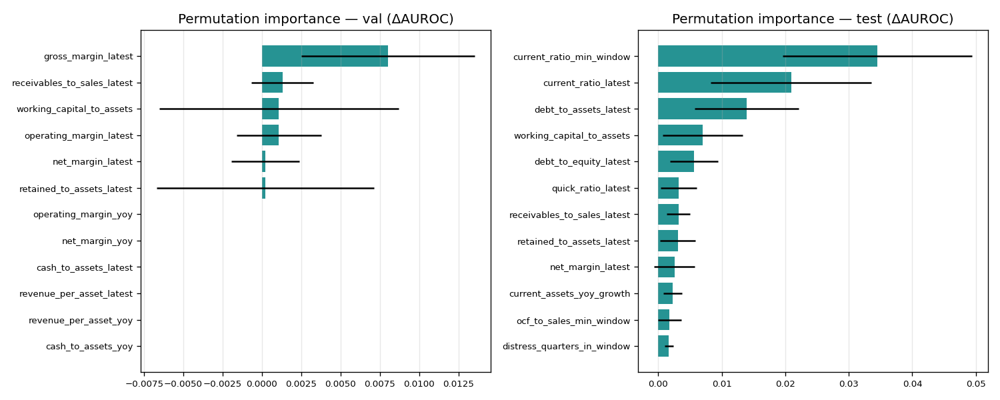

*Hình: Permutation importance trên validation và test*


**Diễn giải.** Các cột dẫn đầu là **đặc trưng cấu trúc vốn / thanh khoản** mang tính bền theo công ty (`current_ratio_latest`, `working_capital_to_assets`, các biến liên quan `total_liabilities`) và nhóm `path` (`current_ratio_min_window`). Điều này khớp với phát hiện ở mục 3.2, 3.4–3.5: mô hình đang tách nhóm công ty theo cấu trúc tài chính ổn định, chứ chưa học được “động lực suy giảm” của từng quý. Lưu ý tích cực: nhóm dựa trên nợ **không còn bị thiếu dữ liệu** — `total_liabilities` phủ 100% mẫu nhờ suy ra từ `A = L + E` (mục 4.5), nên các cột đứng đầu không còn bị chi phối bởi giá trị impute.

### 7.3. Đa cộng tuyến (VIF)

- Số feature có VIF > 10: **33 / 47**.

| Feature | VIF |
|---|---:|
| `cash_to_assets_yoy` | 798.1 |
| `cash_and_equivalents_yoy_growth` | 765.9 |
| `revenue_yoy_growth` | 288.1 |
| `current_ratio_latest` | 244.2 |
| `revenue_per_asset_yoy` | 225.9 |
| `working_capital_to_assets` | 175.4 |
| `current_assets_yoy_growth` | 158.0 |
| `total_assets_yoy_growth` | 144.6 |
| `net_income_yoy_growth` | 139.1 |
| `net_margin_yoy` | 136.2 |

**Hệ quả phương pháp luận:** khi nhiều cột tương quan mạnh (các tỷ số đều có `total_assets` hoặc `current_liabilities` làm mẫu số), hệ số Logistic **không diễn giải được như độ quan trọng nhân quả**. Vì thế báo cáo dùng permutation importance (mục 7.2) làm căn cứ chính và chỉ nêu hệ số để tham khảo. Với mô hình cây, đa cộng tuyến ít ảnh hưởng tới dự báo nhưng làm tăng phương sai của importance.

### 7.4. Ablation — yếu tố nào ảnh hưởng thật?

Bảng ablation đầy đủ ở mục 4.5. Ba kết luận:

1. Bỏ **nhóm tỷ số `latest`** làm test AUROC giảm mạnh nhất ⇒ tín hiệu tập trung ở **mức độ cấu trúc hiện tại**, còn nhóm `ratios_yoy` / `growth` gần như không đóng góp thêm.
2. Biến thể “bỏ cột độ phủ < 50%” nay **không còn cột nào để bỏ** (0 cột; trước đây là 4): sau khi `debt_to_assets` / `debt_to_equity` dùng **nợ suy ra từ `A = L + E`**, không tỷ số nào còn phụ thuộc tag thưa `liabilities` nữa. Vì thế kết luận cũ “chất lượng không phụ thuộc các chỉ tiêu thưa” không còn được kiểm chứng bằng biến thể này — thay vào đó: chỉ tiêu thưa (`receivables`, `short_term_investments`) vẫn chỉ có nghĩa ở một phần mẫu và được impute trong pipeline.
3. Lọc bỏ mẫu có < 5 quý lịch sử làm thay đổi kết quả ở mức nhỏ ⇒ các mẫu “non” không phải nguyên nhân chính của kết quả cao, tuy nhiên vẫn nên lọc khi có nhiều dữ liệu hơn.

### 7.5. Phân tích lỗi (Error Analysis)

| Mẫu | Công ty | Thực tế | Dự đoán | P(distress) | #quý lịch sử | current_ratio | WC/assets | net_margin |
|---|---|---:|---:|---:|---:|---:|---:|---:|
| HD-2024Q2 | HD | 1 | 0 | 0.783 | 37 | 1.34 | 0.10 | 0.099 |
| DG-2025Q2 | DG | 0 | 1 | 0.798 | 29 | 1.23 | 0.05 | 0.038 |
| FIVE-2024Q3 | FIVE | 1 | 0 | 0.174 | 26 | 1.63 | 0.11 | 0.040 |

Tổng số mẫu sai trên test: **3 / 64** — gồm **2 FN** (bỏ sót suy giảm) và **1 FP** (báo động giả) tại ngưỡng vận hành. Chi tiết đầy đủ: `reports/results/error_cases.csv`.

- **Lỗi có cấu trúc, không ngẫu nhiên:** 3 mẫu sai nằm ở 3 công ty DG, FIVE, HD (tỷ lệ nhãn 1 trong toàn bộ dữ liệu của từng công ty: DG ≈ 0.55, FIVE ≈ 0.19, HD ≈ 1.00). Phần lớn các chuỗi nhãn *hằng* (WMT/LOW/HD = 100% nhãn 1, ROST ≈ 0,05) gần như được dự đoán đúng tuyệt đối, nhưng lỗi **không chỉ** xảy ra ở chuỗi nhãn biến động: HD tuy 100% nhãn 1 vẫn bị bỏ sót 1 quý (xác suất sát ngưỡng). Nhóm nhãn biến động (DG, FIVE) là nơi mô hình khó nhất vì nhãn đổi giữa các quý.
- Vùng xác suất của mẫu sai: **0.174–0.798** (`HD-2024Q2` FN P=0.783; `DG-2025Q2` FP P=0.798; `FIVE-2024Q3` FN P=0.174) ⇒ tồn tại cả lỗi “sai rõ” (P = 0.174) lẫn lỗi “sát ngưỡng” (P = 0.798 so với ngưỡng vận hành 0.788); vì vậy **hạ ngưỡng không xoá hết sai số**, nó chỉ dịch chuyển FN ↔ FP (xem mục 7.6).
- Nguyên nhân gốc của sai số **không** phải nhiễu hay ảnh mờ (đây là dữ liệu bảng) mà là: (i) nhãn ở các công ty này biến động giữa các quý, (ii) feature cấu trúc của chúng nằm sát biên quyết định.
- Trong triển khai thực tế, sai số loại này xử lý được bằng cách **hạ ngưỡng** (0.783 cho chi phí kỳ vọng tối thiểu) hoặc rà soát thủ công các mẫu ở vùng xác suất trung bình.

### 7.6. Ngưỡng quyết định: F1 vs chi phí kỳ vọng

| Tập | Ngưỡng best-F1 | F1 tại đó | Ngưỡng tối ưu chi phí | Chi phí kỳ vọng |
|---|---:|---:|---:|---:|
| validation | 0.370 | 0.976 | 0.370 | 5.0 |
| test | 0.360 | 0.950 | 0.360 | 4.0 |


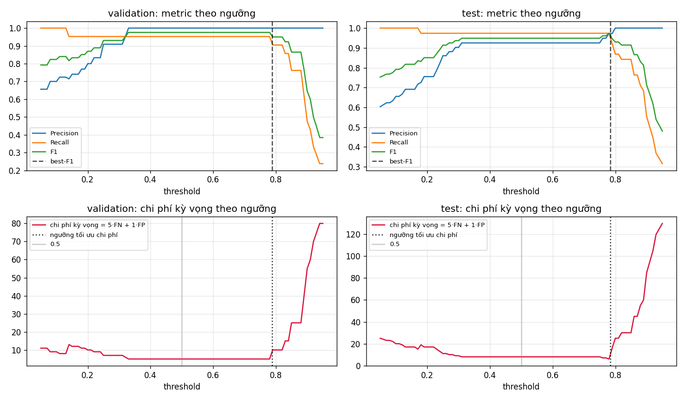

*Hình: Precision/Recall/F1 và chi phí kỳ vọng theo ngưỡng (validation và test)*


**Thảo luận.** Ngưỡng vận hành đang dùng tối đa F1 (mục 5.2) nên ưu tiên precision; nếu đặt chi phí bỏ sót (FN) đắt gấp 5 lần báo động giả (FP) thì ngưỡng tối ưu thấp hơn rõ rệt và recall tiến về 1,0 — tức “không bỏ sót doanh nghiệp nào, chấp nhận nhiều báo động giả”. Đây là tham số **do người dùng quyết định**, không phải do thuật toán.

### 7.7. Hiệu chuẩn xác suất (Calibration)

| Tập | Brier |
|---|---:|
| validation | 0.051 |
| test | 0.053 |


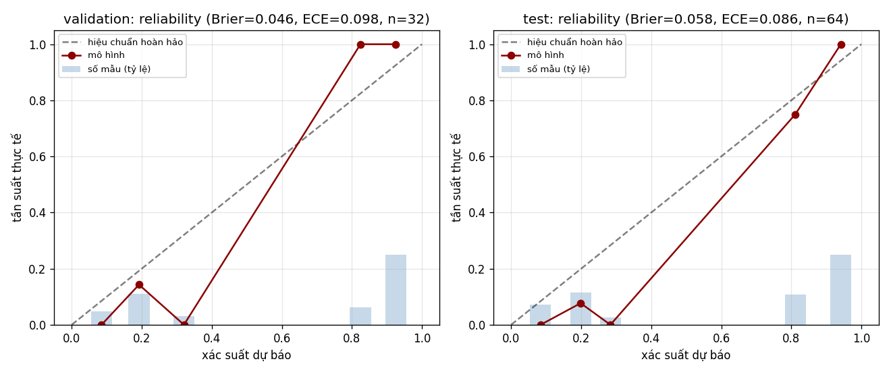

*Hình: Đường reliability: xác suất dự báo vs tần suất thực tế*


Brier ≈ 0,06 trên test cho thấy xác suất đầu ra **khá sát tần suất thực tế**, nên có thể dùng trực tiếp trong bài toán ra quyết định (ví dụ tính lợi ích kỳ vọng). Tuy nhiên n = 64 nên đường reliability chỉ có ít điểm dữ liệu — không nên diễn giải quá mức.

### 7.8. Learning curve — thêm dữ liệu có giúp được không?

| #mẫu train | Train AUROC | Val AUROC (GroupKFold) |
|---:|---:|---:|
| 56 | — | — |
| 83 | 0.998 | 0.795 |
| 109 | 0.996 | 0.877 |
| 135 | 0.994 | 0.900 |
| 162 | 0.989 | 0.902 |


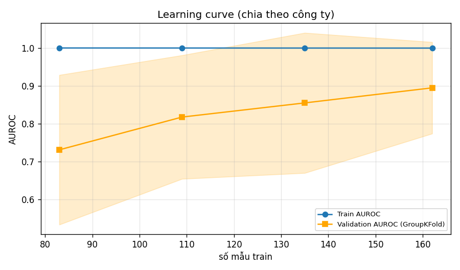

*Hình: Learning curve chia theo công ty — còn thiếu mẫu hay đã bão hoà?*


**Kết luận.** Đường validation trong chế độ chia theo công ty còn khoảng cách lớn so với train và chưa bão hoà ⇒ cách cải thiện hiệu quả nhất **không phải** đổi thuật toán mà là **thêm công ty mới** (tăng số thực thể) và làm sạch định nghĩa nhãn.

### 7.9. Yếu tố nào ảnh hưởng nhiều nhất tới kết quả?

| # | Yếu tố | Mức ảnh hưởng | Bằng chứng trong báo cáo |
|---:|---|---|---|
| 1 | **Nhãn gần như là thuộc tính của công ty** (thực thể) | Rất cao | mục 3.2 (tỷ lệ nhãn theo công ty) và mục 6.4 (AUROC tụt khi cross-company) |
| 2 | **Ít thực thể** — chỉ 8 công ty | Rất cao | mục 7.8 (learning curve) và danh sách công ty không tính được AUROC ở mục 6.4 |
| 3 | **Định nghĩa nhãn** | Cao | mục 8.1–8.2 (nhãn gốc không tái tạo được) |
| 4 | **Cấu trúc vốn / thanh khoản** (current_ratio, working capital, liabilities) | Cao | mục 7.2 (permutation importance) và mục 4.5 (ablation) |
| 5 | **Ngưỡng quyết định** | Trung bình | mục 7.6: đổi ngưỡng đưa recall từ 0,84 lên 1,0 mà không đổi mô hình |
| 6 | **Thuật toán** (logistic / RF / boosting) | Thấp | mục 6.1 và 6.4: ba họ mô hình cho kết quả test gần nhau (in-domain AUROC 0.977–0.983) |
| 7 | **Mẫu quá non (<5 quý lịch sử)** | Thấp | mục 4.5: bỏ 32 mẫu này thay đổi kết quả ở mức nhỏ |
| 8 | **Chỉ tiêu thưa dữ liệu** (receivables, short-term investments) | Thấp–trung bình | mục 4.5: lỗ hổng tag `liabilities` đã được xử lý ở tầng feature (nợ suy ra ⇒ phủ 100%); hai chỉ tiêu còn thưa vẫn được impute trong pipeline và có nhóm tỷ số riêng |


## 8. Truy vết nhãn và kiểm chứng độ nhạy

### 8.1. Nhãn gốc không tái tạo được (audit)

Nhãn `is_distressed` trong `data/prepared` được giữ nguyên từ pipeline sinh dữ liệu gốc (`scripts/prepare_sec.py` **chưa được port**: `main` trả mã lỗi 2 và ghi rõ “CHƯA CÀI ĐẶT”). Vì vậy báo cáo chủ động kiểm tra nhãn có khớp với các quy tắc kế toán đơn giản không:

| Quy tắc thử nghiệm (trên quý target) | Mức khớp với nhãn gốc |
|---|---:|
| `net_income<0` | 39.6% |
| `operating_income<0` | 39.3% |
| `operating_cash_flow<0` | 40.3% |
| `ocf<0 hoặc ni<0` | 40.9% |
| `current_liabilities>current_assets` | 65.3% |
| `stockholders_equity<0` | 51.9% |
| `retained_earnings<0` | 54.2% |
| `stress_signals>=1` | 74.7% |
| `stress_signals>=2` | 47.7% |

| Quy tắc thử nghiệm (trên dòng lịch sử CUỐI CÙNG) | Mức khớp |
|---|---:|
| `net_income<0` | 39.6% |
| `operating_income<0` | 39.3% |
| `operating_cash_flow<0` | 40.3% |
| `ocf<0 hoặc ni<0` | 40.9% |
| `current_liabilities>current_assets` | 65.3% |
| `stockholders_equity<0` | 51.9% |
| `retained_earnings<0` | 54.2% |

- Mức khớp cao nhất trong các quy tắc thử nghiệm: **74.7%** ⇒ nhãn gốc **không** tương ứng với bất kỳ quy tắc đơn giản nào viết lại được.
- Phản chứng cụ thể: **WMT FY2015Q2** có net income dương (≈ 3,59 tỷ USD) nhưng bị gán nhãn = 1.
- Tỷ lệ nhãn = 1 theo công ty: HD 1.00, LOW 1.00, WMT 1.00, ORLY 0.91, DG 0.55, FIVE 0.19, DKS 0.12, ROST 0.05.

**Kết luận 8.1.** Nhãn mang tính **thực thể** cao và không có định nghĩa công khai ⇒ không thể khẳng định mô hình đang dự báo “suy giảm tài chính” theo nghĩa nghiệp vụ. Đây là hạn chế của bộ dữ liệu, được xử lý bằng hai việc: (i) công bố rõ trong báo cáo, (ii) kiểm chứng độ nhạy bằng một định nghĩa nhãn công khai ở mục 8.2.

### 8.2. Kiểm chứng độ nhạy bằng nhãn tái lập được

`scripts.relabel` dựng lại split với nhãn theo công thức công khai (`forecasting/labels.py`; rule = `stress_signals`, min_signals = 1): nhãn = 1 nếu quý target có ≥ 1 tín hiệu trong số: lỗ ròng, dòng tiền hoạt động âm, lỗ hoạt động, vốn lưu động âm, vốn chủ sở hữu âm, doanh thu giảm > 5% so với cùng kỳ. Nhãn tính trên **quý target** (chỉ công bố sau `as_of`) nên **không** rò rỉ vào feature.

- Mức khớp giữa nhãn quy tắc và nhãn gốc: **74.4%** trên 324 mẫu ⇒ hai bộ nhãn khác nhau rõ rệt, nên đây là một phép thử độ nhạy thực chất.

| Hệ thống (nhãn quy tắc) | Val AUROC | Test AUROC | Test AP | Test F1 | Test macro-F1 |
|---|---:|---:|---:|---:|---:|
| model[logistic] | 0.933 | 0.931 | 0.949 | 0.773 | 0.827 |
| model[random_forest] | 0.905 | 0.909 | 0.941 | 0.920 | 0.934 |
| model[hist_gradient_boosting] | 0.857 | 0.922 | 0.932 | 0.851 | 0.882 |
| baseline[ticker_prior] | 0.944 | 0.960 | 0.958 | 0.744 | 0.807 |

| Hệ thống (cross-company, nhãn quy tắc) | AUROC | AP | F1 |
|---|---:|---:|---:|
| model[logistic] — cross-company | 0.369 | 0.399 | 0.247 |
| model[random_forest] — cross-company | 0.731 | 0.649 | 0.393 |
| model[hist_gradient_boosting] — cross-company | 0.638 | 0.608 | 0.391 |

- Số mẫu dương tính theo nhãn quy tắc: `{'train': 88, 'validation': 14, 'test': 27, 'purged': 8}` → nhãn quy tắc **cân bằng hơn** và **biến thiên theo quý** (không phải hằng số theo công ty).
- **Kết luận:** kết luận “bài toán bị chi phối bởi thực thể” lặp lại trên cả hai định nghĩa nhãn ⇒ kết luận không phụ thuộc vào cách gán nhãn cụ thể.

### 8.3. Kết luận về độ tin cậy của kết quả

| Câu hỏi kiểm tra | Kết quả | Mức tin cậy |
|---|---|---|
| Có rò rỉ thời gian (dùng dữ liệu tương lai) không? | Không — có kiểm thử tự động | Cao |
| Có rò rỉ tiền xử lý (impute/scale trên toàn dữ liệu) không? | Không — nằm trong Pipeline | Cao |
| Có rò rỉ do chia tập ngẫu nhiên không? | Không — chia theo thời gian + purge | Cao |
| Có **rò rỉ cấp thực thể** không? | **Có** — đã đo và định lượng | Cao |
| Nhãn có định nghĩa kiểm chứng được không? | Không (nhãn gốc); đã bù bằng nhãn quy tắc | Trung bình |
| Kết quả có lặp lại khi chạy lại không? | Có — seed cố định, output ổn định | Cao |


## 9. Kiểm chứng bổ sung (tiền xử lý đuôi nặng · SHAP · ý nghĩa thống kê)

Ba hạng mục dưới đây được thêm để đóng các lỗ hổng đã nêu ở mục 9.2 (hạn chế): xử lý outlier, giải thích từng hồ sơ, và kiểm định "hơn nhau có thật không".

### 9.1. Winsorize × scaler trên dữ liệu thật (`scripts.experiment_preprocessing.py`)

- Giao thức: fit trên train; in-domain trên validation; tổng quát hoá bằng GroupKFold(4) trên train+validation, gộp xác suất out-of-fold; **24 cấu hình** (4 họ mô hình).

1. **Cấu hình pipeline chính** (logistic + standard + không winsorize): Val AP = 0.9869, cross-company AP = 0.9232.
2. **Tốt nhất theo validation:** logistic + standard + winsorize=p1p99 → Val AP = 0.9908 (+0.40 điểm %), cross-company AP = 0.9417.
3. **Tốt nhất theo cross-company:** random_forest + none + winsorize=iqr → cross-company AP = 0.9590 (+3.58 điểm %).
4. **Riêng tác động của winsorize** (cùng model/scaler, so với không clip): trung bình +0.73 điểm % cross-company AP, tốt nhất +3.95, xấu nhất -0.11 trên 16 cặp so sánh ⇒ cải thiện rõ về trung bình, ĐẶC BIỆT cho mô hình tuyến tính; xem mục dưới để biết tác động trên đúng mô hình được chốt.
5. **Trên ĐÚNG mô hình được chốt (`random_forest`, đọc từ `summary.json`)**: winsorize=iqr cho cross-company AP 0.9590 so với 0.9577 khi không clip ⇒ +0.13 điểm % — nằm trong khoảng nhiễu của 244 mẫu out-of-fold, nên **pipeline chính giữ không winsorize** (đơn giản, dễ diễn giải) và winsorize chỉ được dùng như một biến thể ablation; muốn đổi mặc định cần thêm công ty/dữ liệu.
6. **Scaler cho mô hình tuyến tính** (không winsorize): tốt nhất là `standard` với cross-company AP = 0.9232 (StandardScaler = 0.9232) ⇒ khác biệt không đáng kể (dưới 0,5 điểm %), nên giữ StandardScaler cho gọn và ghi lại kết quả âm này như một kết luận trung thực.

| Mô hình | Scaler | Winsorize | Val AP | Cross-co. AP | Cross-co. AUROC | % clip trên val |
|---|---|---|---:|---:|---:|---:|
| random_forest | none | iqr | 0.9894 | 0.9590 | 0.9451 | 8.31 |
| random_forest | robust | iqr | 0.9894 | 0.9590 | 0.9451 | 8.31 |
| random_forest | none | p1p99 | 0.9869 | 0.9578 | 0.9433 | 4.78 |
| random_forest | robust | p1p99 | 0.9869 | 0.9578 | 0.9433 | 4.78 |
| random_forest | none | none | 0.9869 | 0.9577 | 0.9431 | — |
| random_forest | robust | none | 0.9869 | 0.9577 | 0.9431 | — |
| hist_gradient_boosting | none | iqr | 0.9908 | 0.9575 | 0.9416 | 8.31 |
| hist_gradient_boosting | robust | iqr | 0.9908 | 0.9575 | 0.9416 | 8.31 |


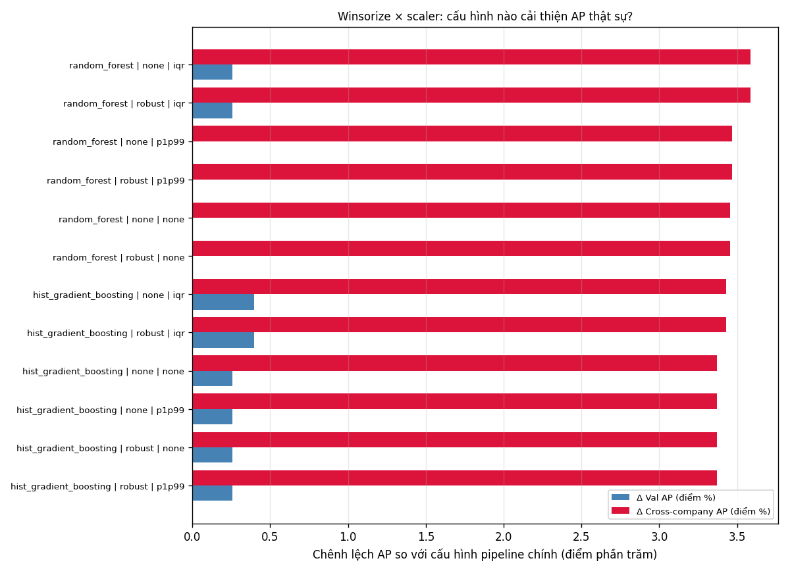

*Hình: ΔAP của các cấu hình tiền xử lý so với pipeline chính (winsorize × scaler)*


### 9.2. Giải thích mô hình bằng SHAP — KernelSHAP tự cài đặt (`scripts/explain_model.py`)

- Mô hình: **random_forest**; giải thích **64 mẫu** (validation 32 + test 32), 200 liên minh/điểm, nền 40 mẫu train.
- Vì sao tự cài: môi trường đồ án không có gói `shap`; thuật toán được cài đúng theo Lundberg & Lee (2017) bằng numpy — KernelSHAP tự cài đặt (Lundberg & Lee 2017), π(S) = (M−1)/[C(M,|S|)·|S|·(M−|S|)].
- **Tự kiểm chứng:** sai số efficiency |Σφ + E[f] − f(x)| ≤ 0.000000000000 (tương đối 0.000000000000); công thức còn được đối chiếu giải tích cho hàm tuyến tính trong `tests/test_explain.py`.
- **Đối chiếu permutation importance** (phương pháp độc lập): Spearman = 0.362, trùng top-15 = 0.429.

| # | Feature | mean |φ| |
|---:|---|---:|
| 1 | current_ratio_latest | 0.0765 |
| 2 | current_ratio_min_window | 0.0764 |
| 3 | debt_to_assets_latest | 0.0583 |
| 4 | working_capital_to_assets | 0.0561 |
| 5 | debt_to_equity_latest | 0.0356 |
| 6 | quick_ratio_latest | 0.0230 |
| 7 | receivables_to_sales_latest | 0.0218 |
| 8 | gross_margin_latest | 0.0212 |
| 9 | retained_to_assets_latest | 0.0208 |
| 10 | operating_margin_latest | 0.0187 |

**Giải thích cục bộ các mẫu dự đoán sai** (đóng góp dương đẩy về phía suy giảm):

| Mẫu | Thực tế | P(nhãn 1) | Feature đẩy về suy giảm | Feature kéo về an toàn |
|---|---:|---:|---|---|
| FIVE-2023Q3 | 1 | 0.132 | operating_income_yoy_growth (+0.07), negative_ni_streak (+0.06), quick_ratio_yoy (+0.05), gross_margin_latest (+0.04) | current_ratio_min_window (-0.12), current_ratio_latest (-0.11), debt_to_assets_latest (-0.10), working_capital_to_assets (-0.07) |
| HD-2024Q2 | 1 | 0.783 | debt_to_assets_latest (+0.09), debt_to_equity_latest (+0.08), receivables_to_sales_latest (+0.04), operating_margin_latest (+0.03) | current_ratio_min_window (-0.07), current_ratio_latest (-0.05), sgna_pct_revenue_latest (-0.03), debt_to_assets_yoy (-0.02) |


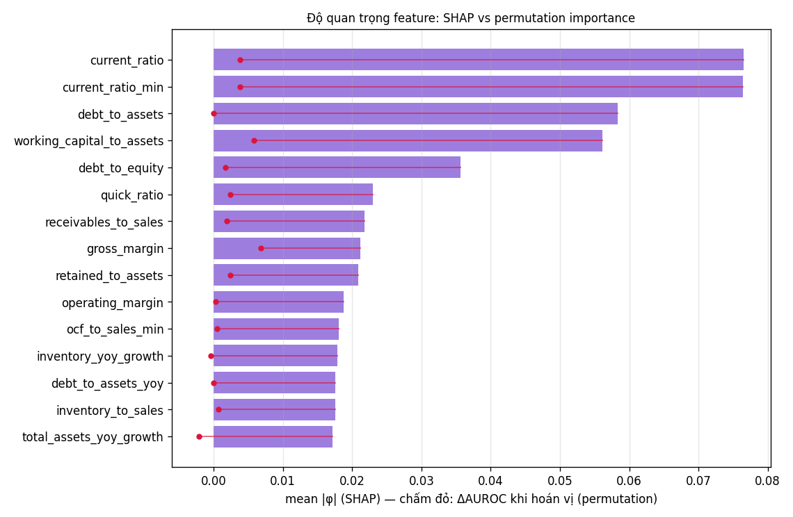

*Hình: SHAP: độ quan trọng feature (mean |φ|) kèm đối chiếu permutation*


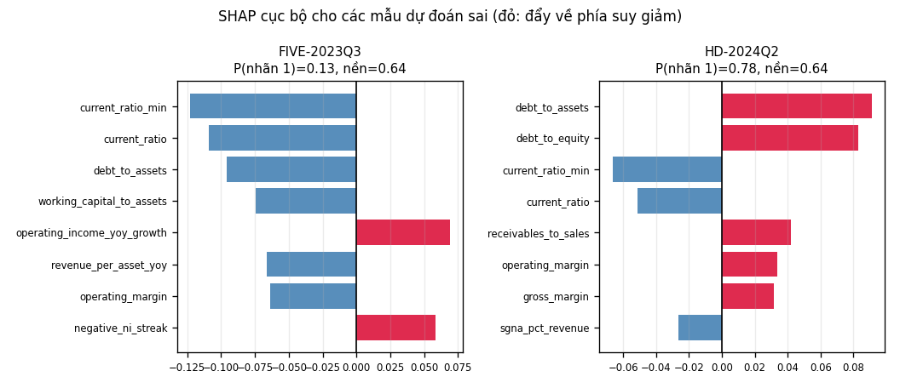

*Hình: SHAP cục bộ cho các mẫu dự đoán sai — căn cứ giải trình từng hồ sơ*


### 9.3. Kiểm định ý nghĩa thống kê trên test (`scripts/significance.py`)

- Cùng **64 mẫu test** (38 dương) cho mọi hệ thống: DeLong (1988) cho ΔAUROC + paired bootstrap cho ΔAP (CI 95%, seed cố định).

| Hệ thống | AUROC | Average Precision |
|---|---:|---:|
| model[random_forest] | 0.9828 | 0.9908 |
| ticker_prior | 0.9858 | 0.9846 |
| single_feature[debt_to_assets_latest] | 0.8887 | 0.9379 |
| dummy_most_frequent | 0.5000 | 0.5938 |

1. **ΔAUROC (DeLong):** model[random_forest] − ticker_prior = -0.0030, z = -0.3126, p = 0.7546 ⇒ **không** có ý nghĩa ở mức 5% (chưa thể khẳng định mô hình hơn baseline).
2. **ΔAP (paired bootstrap 2000 vòng):** +0.0061, CI 95% = [-0.0048; +0.0215], p = 0.3440 ⇒ kết luận tương tự DeLong.
3. **Cách đọc:** n = 64 mẫu nên khoảng tin cậy rộng; "không khác biệt" nghĩa là *dữ liệu chưa đủ để khẳng định*, không phải bằng chứng mô hình kém. Đây là lý do báo cáo dùng thêm so sánh cross-company (`validation_checks.json`) và lấy `ticker_prior` làm mốc trung thực.

| A | B | ΔAUROC (A−B) | p (DeLong) | ΔAP (A−B) | CI95 ΔAP | p (bootstrap AP) |
|---|---|---:|---:|---:|---:|---:|
| model[random_forest] | ticker_prior | -0.0030 | 0.7546 | 0.0061 | -0.0048; +0.0215 | 0.3440 |
| ticker_prior | single_feature[debt_to_assets_latest] | 0.0972 | 0.0105 | 0.0467 | +0.0074; +0.0941 | 0.0180 |
| ticker_prior | dummy_most_frequent | 0.4858 | 0.0000 | 0.3909 | +0.3703; +0.4042 | 0.0000 |

> Đọc bảng: p ≥ 0,05 ⇒ **chưa đủ căn cứ** khẳng định mô hình hơn baseline trên bộ test 64 mẫu này. Đây là kết luận trung thực, không phải điểm yếu bị che: báo cáo vì thế nhấn mạnh so sánh cross-company và baseline `ticker_prior`.
### 9.4. Kỹ thuật xử lý lệch lớp trên dữ liệu THẬT (`scripts.experiment_imbalance_real.py`)

- Giao thức: GroupKFold(4) theo mã cổ phiếu trên train+validation (244 mẫu); mô hình nền **hist_gradient_boosting** ⇒ mọi kỹ thuật khác nhau CHỈ ở bước xử lý lệch lớp. Mất cân bằng cấp mẫu IR ≈ 1.68.

| Kỹ thuật | Nhóm | AP (OOF) | AUROC (OOF) | F1* OOF | IR trước → sau | Test fold nguyên vẹn |
|---|---|---:|---:|---:|---:|---|
| smote_enn | hybrid | 0.9683 | 0.9512 | 0.9158 | 1.32 → 1.12 | PASS |
| none | baseline | 0.9588 | 0.9426 | 0.9419 | — | PASS |
| class_weight | algorithm-level | 0.9569 | 0.9404 | 0.9419 | — | PASS |
| random_under | undersampling | 0.9561 | 0.9267 | 0.9265 | 1.32 → 1.00 | PASS |
| focal_loss | algorithm-level | 0.9542 | 0.9369 | 0.9355 | — | PASS |
| smote | oversampling | 0.9502 | 0.9500 | 0.9311 | 1.32 → 1.00 | PASS |
| tomek_links | undersampling | 0.9428 | 0.9160 | 0.9159 | 1.32 → 1.23 | PASS |

1. **Đối chứng (không can thiệp):** cross-company AP = 0.9588, AUROC = 0.9426 (IR cấp mẫu của corpus ≈ 1.68 — mất cân bằng NHẸ).
2. **Kết quả trên dữ liệu thật:** 1 kỹ thuật hơn đối chứng > 0,5 điểm % AP, 2 kỹ thuật kém hơn > 0,5 điểm %. Tốt nhất: **smote_enn** (AP 0.9683).
3. **Cách đọc:** AP ở đây là OOF cross-company — mỗi công ty bị giữ trọn ra ngoài, nên kết quả không thể đến từ việc "nhớ mặt công ty". Vì vậy đây là phép thử công bằng cho kỹ thuật resampling/cost-sensitive, khác hẳn so sánh in-domain.
4. **Lưu ý về CHIỀU của mất cân bằng (khác bộ dữ liệu phá sản thông thường):** trong corpus này lớp 1 (suy giảm) chiếm **62%** ⇒ lớp THIỂU SỐ là lớp 0. Vì vậy SMOTE ở đây **sinh thêm mẫu "không suy giảm"**, tức can thiệp theo hướng ngược với thực hành phổ biến — một lý do nữa để mất cân bằng không phải nút thắt của bài toán này.
5. **Kiểm định cặp cho kỹ thuật tốt nhất** (`smote_enn` vs `none`, cùng 244 mẫu OOF): ΔAP = +0.0095 (CI 95% [-0.0054; +0.0269], p = 0.21), ΔAUROC (DeLong) = +0.0087 (p = 0.4741232109103479) ⇒ **chưa** đủ căn cứ khẳng định hơn đối chứng (khoảng tin cậy chứa 0).
6. **Chống rò rỉ:** mọi kỹ thuật đều có sampler nằm trong pipeline ⇒ tập test của từng fold KHÔNG bị resample (đã kiểm tra bằng so khớp ma trận trước/sau fit).

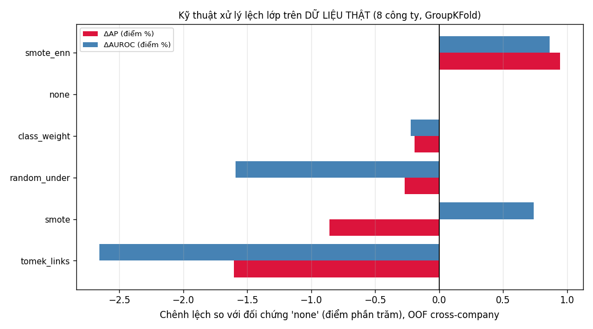

*Hình: ΔAP/ΔAUROC của các kỹ thuật lệch lớp so với đối chứng (OOF cross-company)*


### 9.5. Tìm kiếm siêu tham số + sổ thực nghiệm (`scripts/search.py`)

- random search (log-uniform cho tham số scale) + log MỌI trial; môi trường không có Optuna nên dùng cách này, không gian tham số mô tả ở `SEARCH_SPACES`
- Mục tiêu: AP out-of-fold, StratifiedGroupKFold theo công ty trên train+validation; **25 trial/mô hình**; sổ thực nghiệm `results\runs.csv` gồm **98 dòng**.

| Mô hình | #trial | CV-AP tốt nhất | CV-AP mặc định | CV-AP GridSearchCV | Δ vs Grid | Δ vs mặc định | Thời gian (s) |
|---|---:|---:|---:|---:|---:|---:|---:|
| logistic | 25 | 0.9669 | 0.9583 | 0.9603 | 0.0066 | 0.0086 | 0.9 |
| random_forest | 23 | 0.9855 | 0.9810 | 0.9890 | -0.0035 | 0.0045 | 72.8 |
| hist_gradient_boosting | 25 | 0.9648 | 0.9095 | 0.9386 | 0.0262 | 0.0553 | 20.0 |
| lightgbm | 25 | 0.9668 | 0.9341 | 0.9174 | 0.0494 | 0.0328 | 8.0 |

*Diễn giải:* cột **Δ vs Grid** so random search với lưới `GridSearchCV` cũ trên cùng thước đo CV-AP và cùng splitter.
- Random search **tốt hơn** ở: `hist_gradient_boosting` (+0.0262), `lightgbm` (+0.0494) ⇒ với các họ mô hình này, tìm kiếm rộng thật sự có ích (lưới cũ quá thô).
- Mọi trial (params, seed, CV-AP, thời gian) đều nằm trong sổ `runs.csv` ⇒ tra cứu lại được, và khi môi trường có Optuna chỉ cần thay `sample_params` (không phải viết lại hạ tầng).


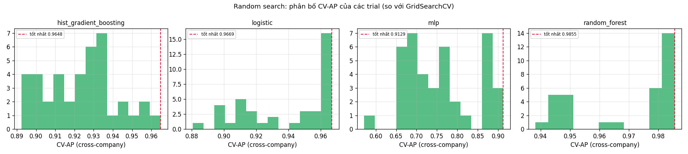

*Hình: Phân bố CV-AP của các trial random search (so với GridSearchCV)*


### 9.6. Độ nhạy của kết luận theo ĐỊNH NGHĨA NHÃN (`scripts/label_sensitivity.py`)

- Mô hình cố định **random_forest**; mỗi định nghĩa nhãn dựng lại split bằng `split_policy` rồi đo độc lập (in-domain + cross-company + mức khớp nhãn gốc).

| Định nghĩa | Dương (test) | IR train | Khớp nhãn gốc | AUROC test (mô hình) | AUROC test (prior) | Cross-co. AP | Cross-co. AUROC |
|---|---:|---:|---:|---:|---:|---:|---:|
| original | 59.4% | 1.65 | 100.0% | 0.983 | 0.986 | 0.958 | 0.943 |
| stress_signals | 42.2% | 1.41 | 74.4% | 0.909 | 0.960 | 0.610 | 0.730 |
| altman_z | 31.2% | 3.42 | 63.9% | 0.999 | 0.991 | 0.460 | 0.772 |
| forward_4q | 48.4% | 1.99 | 66.7% | 0.836 | 0.911 | 0.582 | 0.410 |

1. **Số định nghĩa nhãn TÁI LẬP ĐƯỢC đã kiểm chứng:** 3 (stress_signals, altman_z, forward_4q).
2. **Luận điểm "mô hình không vượt baseline ticker-prior" xuất hiện ở 3/3 định nghĩa** ⇒ kết luận **ỔN ĐỊNH theo định nghĩa nhãn** — đây là bằng chứng mạnh nhất của đồ án.
3. **`stress_signals`:** tỉ lệ dương test = 42.2%, IR train = 1.41; khớp nhãn gốc = 74.4%; in-domain AUROC (mô hình / ticker-prior) = 0.909 / 0.960; cross-company OOF AP = 0.610, AUROC = 0.730.
4. **`altman_z`:** tỉ lệ dương test = 31.2%, IR train = 3.42; khớp nhãn gốc = 63.9%; in-domain AUROC (mô hình / ticker-prior) = 0.999 / 0.991; cross-company OOF AP = 0.460, AUROC = 0.772.
5. **`forward_4q`:** tỉ lệ dương test = 48.4%, IR train = 1.99; khớp nhãn gốc = 66.7%; in-domain AUROC (mô hình / ticker-prior) = 0.836 / 0.911; cross-company OOF AP = 0.582, AUROC = 0.410.
6. **Đọc kết quả:** cột khớp nhãn gốc cho biết định nghĩa mới có đo cùng khái niệm với nhãn gốc hay không; cột cross-company cho biết mô hình còn giữ được bao nhiêu khi công ty bị giữ trọn ra ngoài. Một định nghĩa chỉ đáng tin khi cả hai hợp lý (khớp > ~65% và cross-company ≈ 0,9).


## 10. Kết luận và hướng phát triển

### 10.1. Kết luận chính

1. Các họ mô hình (Logistic, Random Forest, HistGradientBoosting, LightGBM) đều đạt AUROC test ~0,97–0,98; mô hình được chốt là **Random Forest** theo quy tắc công bố trước ở mục 5.2 (`max AP cross-company (GroupKFold, train+validation) → best-F1(val) → AP(val) → AUROC(val) → gap overfit nhỏ nhất`) — tức ưu tiên khả năng tổng quát hoá sang công ty chưa từng thấy, không ưu tiên điểm in-domain.
2. **Nhưng** baseline “nhớ mặt công ty” (ticker-prior) đạt AUROC = 0.986, tức mô hình học máy **không vượt** nổi một quy tắc chỉ dùng danh tính công ty. Khi đánh giá cross-company, AUROC giảm còn 0.933; LOCO chỉ tính được AUROC trên **8/8** công ty — phần còn lại có nhãn đơn lớp ở cả validation và test nên AUROC không xác định (xem mục 6.4).
3. Đóng góp chính của đồ án là **phát hiện và định lượng rò rỉ cấp thực thể** — dạng lỗi thực nghiệm rất dễ bị bỏ qua nếu báo cáo chỉ trình bày bảng AUROC/F1 đẹp.
4. Bộ công cụ đánh giá được chuẩn hoá và tái lập được bằng một lệnh: baseline đối chứng, cross-company CV, bootstrap CI, calibration, ngưỡng theo chi phí, ablation, error analysis.

### 10.2. Hạn chế

1. **Nhãn gốc không tái tạo được** (mục 8.1) — hạn chế lớn nhất; đã giảm nhẹ bằng kiểm chứng độ nhạy với nhãn quy tắc (mục 8.2).
2. **Chỉ 8 công ty** → không đủ để kết luận thống kê về tổng quát hoá; nhiều công ty chỉ có một lớp nhãn nên AUROC không xác định.
3. **Mẫu không độc lập**: cửa sổ lịch sử 8 quý trượt nên các mẫu liền nhau chia sẻ phần lớn dữ liệu; số quan sát hiệu dụng nhỏ hơn 324.
4. **Chưa xử lý outlier** (winsorize/clip) và chưa thử mô hình chuỗi thời gian (LSTM/GRU, transformer cho chuỗi quý).
5. **Thiếu dữ liệu ngoài báo cáo tài chính** (giá cổ phiếu, xếp hạng tín dụng, vĩ mô) — nguồn tín hiệu quan trọng của bài toán suy giảm.

### 10.3. Hướng phát triển

Hai hướng **đã triển khai** trong phiên bản này (nợ phải trả suy ra từ `A = L + E` và nhóm `path`) đều được đo trước bằng `scripts/probe_features.py` (nested CV, cross-company AUROC: 0,817 → 0,901 với Logistic; 0,886 → 0,930 với Random Forest). Bảng dưới là các hướng còn lại:

| # | Hướng | Vì sao hiệu quả (theo bằng chứng trong báo cáo) |
|---:|---|---|
| 1 | Mở rộng lên 50–100 công ty cùng ngành | Learning curve (7.8) chưa bão hoà; kết quả cao hiện nay phần lớn do “nhận diện công ty” nên cần nhiều thực thể hơn |
| 2 | Định nghĩa nhãn công khai, có cơ sở học thuật (Altman Z-score, O-score, dòng tiền âm ≥ 2 quý liên tiếp) | Mục 8: nhãn hiện tại không kiểm chứng được; nhãn quy tắc cân bằng hơn |
| 3 | Đánh giá walk-forward theo thời gian và theo nhóm ngành | Đo đúng “công ty mới + giai đoạn mới”, sát câu hỏi nghiệp vụ |
| 4 | Mô hình chuỗi thời gian / mô hình survival (Cox, discrete-time hazard) | Tận dụng cấu trúc dọc của dữ liệu thay vì vector hoá 8 quý |
| 5 | Bổ sung feature phi tài chính (giá, sở hữu, tin tức) | Ba họ mô hình cho kết quả gần nhau (6.1) ⇒ giới hạn nằm ở dữ liệu, không ở thuật toán |
| 6 | Quy trình ra quyết định theo chi phí thực tế của tổ chức | Mục 7.6: ngưỡng là biến quyết định mạnh, miễn phí để cải thiện recall/F1 |
| 7 | Thêm chỉ tiêu XBRL đã đo được độ phủ (`scripts/probe_tags.py`): `AccountsPayableCurrent` 100% → DPO/chu kỳ tiền mặt; `PaymentsToAcquirePropertyPlantAndEquipment` ~75% → FCF = OCF − capex; `IncomeTaxExpenseBenefit` 100% → thuế suất thực tế | Chọn chỉ tiêu theo độ phủ ĐO ĐƯỢC trên snapshot SEC thay vì đoán; các tag nợ chi tiết (`LongTermDebt*`, `InterestExpense`) chỉ phủ 26–46% nên đã loại |

### 10.4. Bài học phương pháp luận

1. Với bài toán có nhãn gắn với **thực thể** (công ty, người, thiết bị), bắt buộc phải có **baseline theo thực thể** và **chia tập theo thực thể**; chỉ số cao trong chế độ in-domain có thể chỉ là “nhớ mặt”.
2. Luôn kèm **khoảng tin cậy** và **baseline** khi báo cáo metric: n = 64 không cho phép khẳng định chênh lệch 0,002 AUROC.
3. **Mọi số liệu nên sinh tự động từ artifact**: báo cáo này làm vậy nên hình, bảng và JSON không thể lệch nhau (lỗi khó phát hiện khi tổng hợp thủ công).

## 11. Tài liệu tham khảo

Mọi mục dưới đây **được dùng thật** trong mã nguồn (hoặc để định nghĩa nhãn/ngưỡng), không có mục nào chỉ để trang trí; cột cuối ghi rõ vị trí sử dụng để đối chiếu. Các trích dẫn trong thân báo cáo (Beaver 1966; Altman 1968; Barboza và cộng sự 2017; Mai và cộng sự 2019; DeLong và cộng sự 1988; Lundberg & Lee 2017) đều có mặt đầy đủ ở đây.

| Nhóm | Tài liệu | Dùng ở đâu trong repo |
|---|---|---|
| Dữ liệu | U.S. Securities and Exchange Commission. *EDGAR Application Programming Interfaces — company facts (XBRL)*. https://www.sec.gov/edgar/sec-api-documentation (truy cập 2026). | `scripts/crawl_sec.py`, `scripts/prepare_sec.py`, `data/sec/` |
| Cơ sở học thuật cho nhãn | Beaver, W. H. (1966). Financial ratios as predictors of failure. *Journal of Accounting Research*, 4, 71–111. | Nhóm đặc trưng tỷ số (`forecasting/features.py`); mục 2.1, 8.1 |
|  | Altman, E. I. (1968). Financial ratios, discriminant analysis and the prediction of corporate bankruptcy. *The Journal of Finance*, 23(4), 589–609. | Nhãn quy tắc `altman_z` (`forecasting/labels.py`); mục 8.2 |
|  | Ohlson, J. A. (1980). Financial ratios and the probabilistic prediction of bankruptcy. *Journal of Accounting Research*, 18(1), 109–131. | Nhóm tín hiệu của nhãn `stress_signals` (thu nhập/dòng tiền/vốn chủ); mục 8.2 |
|  | Altman, E. I. (2000). *Predicting financial distress of companies: Revisiting the Z-score and ZETA models.* Working paper, Stern School of Business, New York University. | Ngưỡng Z'' < 1,1 (`ALTMAN_DISTRESS_BELOW`); mục 8.2 |
|  | Barboza, F., Kimura, H., & Altman, E. (2017). Machine learning models and bankruptcy prediction. *Expert Systems with Applications*, 83, 405–417. | So sánh mô hình cây/boosting với mô hình tuyến tính; mục 2.1, 6.6 |
|  | Mai, F., Tian, S., Lee, C., & Ma, L. (2019). Deep learning models for bankruptcy prediction using textual disclosures. *European Journal of Operational Research*, 274(2), 743–758. | Bối cảnh “học máy cho distress”; mục 2.1, 10.3 |
| Thuật toán | Breiman, L. (2001). Random forests. *Machine Learning*, 45(1), 5–32. | `random_forest` (`forecasting/models.py`) — mô hình được chốt |
|  | Friedman, J. H. (2001). Greedy function approximation: A gradient boosting machine. *The Annals of Statistics*, 29(5), 1189–1232. | `hist_gradient_boosting` (scikit-learn) — mô hình so sánh |
|  | Ke, G., Meng, Q., Finley, T., Wang, T., Chen, W., Ma, W., Ye, Q., & Liu, T.-Y. (2017). LightGBM: A highly efficient gradient boosting decision tree. *NeurIPS 30*. | `lightgbm` — mô hình so sánh (`forecasting/models.py`) |
|  | Pedregosa, F., và cộng sự (2011). Scikit-learn: Machine learning in Python. *Journal of Machine Learning Research*, 12, 2825–2830. | `Pipeline`, `GridSearchCV`, `StratifiedGroupKFold`, metric |
| Mất cân bằng & metric | Chawla, N. V., Bowyer, K. W., Hall, L. O., & Kegelmeyer, W. P. (2002). SMOTE: Synthetic minority over-sampling technique. *Journal of Artificial Intelligence Research*, 16, 321–357. | `imbalance_lab/`, `scripts/experiment_imbalance_real.py`; mục 9.4 |
|  | He, H., & Garcia, E. A. (2009). Learning from imbalanced data. *IEEE Transactions on Knowledge and Data Engineering*, 21(9), 1263–1284. | Chính sách không dùng Accuracy; chọn AP/F1-macro/MCC (mục 3.2, 6.2) |
|  | Saito, T., & Rehmsmeier, M. (2015). The precision-recall plot is more informative than the ROC plot when evaluating binary classifiers on imbalanced datasets. *PLOS ONE*, 10(3), e0118432. | Ưu tiên PR-AUC (AP) làm tiêu chí chọn mô hình/ngưỡng (mục 5.2, 6.1) |
|  | Brier, G. W. (1950). Verification of forecasts expressed in terms of probability. *Monthly Weather Review*, 78(1), 1–3. | Hiệu chuẩn xác suất — Brier score (mục 7.7) |
| Thống kê & kiểm định | DeLong, E. R., DeLong, D. M., & Clarke-Pearson, D. L. (1988). Comparing the areas under two or more correlated receiver operating characteristic curves: A nonparametric approach. *Biometrics*, 44(3), 837–845. | `forecasting/significance.py` — ΔAUROC so với baseline (mục 9.3) |
|  | Efron, B., & Tibshirani, R. J. (1993). *An Introduction to the Bootstrap*. Chapman & Hall. | `bootstrap_ci`, paired bootstrap (mục 6.5, 9.3) |
|  | Benjamini, Y., & Hochberg, Y. (1995). Controlling the false discovery rate: A practical and powerful approach to multiple testing. *JRSS-B*, 57(1), 289–300. | BH-FDR khi sàng 47 đặc trưng trong EDA chuyên sâu (mục 3.7) |
|  | Virtanen, P., và cộng sự (2020). SciPy 1.0: Fundamental algorithms for scientific computing in Python. *Nature Methods*, 17, 261–272. | KS test, Mann–Whitney, Spearman trong `forecasting/eda.py` |
| Giải thích mô hình | Lundberg, S. M., & Lee, S.-I. (2017). A unified approach to interpreting model predictions. *NeurIPS 30*, 4765–4774. | `forecasting/explain.py` — KernelSHAP tự cài đặt (mục 9.2) |
| Đánh giá & rò rỉ | Kaufman, S., Rosset, S., & Perlich, C. (2012). Leakage in data mining: Formulation, detection, and avoidance. *ACM TKDD*, 6(4), Article 15. | Checklist chống rò rỉ (mục 4.6) + thí nghiệm minh hoạ mốc SAI |
|  | Roberts, D. R., và cộng sự (2017). Cross-validation strategies for data with temporal, spatial, hierarchical, or phylogenetic structure. *Ecography*, 40(8), 913–929. | CV theo nhóm công ty (`StratifiedGroupKFold`, `GroupKFold`) + dải purge |
| Hướng phát triển | Shumway, T. (2001). Forecasting bankruptcy more accurately: A simple hazard model. *The Journal of Business*, 74(1), 101–124. | Đề xuất mô hình sống sót/hazard theo thời gian (mục 10.3) |
|  | Campbell, J. Y., Hilscher, J., & Szilagyi, J. (2008). In search of distress risk. *The Journal of Finance*, 63(6), 2899–2939. | Căn cứ cho định nghĩa distress theo chuỗi nhiều quý (`forward_4q`) |

**Ghi chú về thư viện:** môi trường đồ án không có gói `shap`, `optuna`, `catboost`, nên KernelSHAP được cài lại bằng numpy theo Lundberg & Lee (2017) và tự kiểm chứng bằng sai số efficiency (mục 9.2), còn tìm kiếm siêu tham số dùng random search + sổ thực nghiệm thay cho Optuna (mục 9.5). Việc không thêm thư viện không đổi kết luận: các họ mô hình hiện có chênh nhau < 0,01 AUROC trên test (mục 6.1).

**Ghi chú về số liệu:** mọi con số trong báo cáo được đọc trực tiếp từ `reports/results/*.json` bởi `python -m scripts.make_report` — xem Phụ lục A (lệnh tái lập) và Phụ lục B (danh mục artifact).


## Phụ lục A — Tái lập toàn bộ kết quả

```powershell
python -m pip install -r requirements.txt
python -m scripts.run_all              # data → eda → train → baselines → validation → tuning
                                       # → evaluate → report → analyze → relabel
                                       # → make_report → export_office
python -m pip install -r imbalance_lab/requirements.txt
python -m imbalance_lab.techniques     # danh mục 15 kỹ thuật (Yêu cầu 2) + ngưỡng theo PR
python -m unittest discover -s tests -v   # kiểm thử (gồm chống rò rỉ dữ liệu)
```

Cách chạy riêng từng bước và ý nghĩa từng artifact: `docs/huong-dan-tai-lap.md`.

## Phụ lục B — Danh mục artifact (đều sinh tự động)

| Đường dẫn | Nội dung |
|---|---|
| `reports/results/eda_summary.json`, `reports/results/eda.md` | Số liệu EDA + thống kê mô tả + tương quan + nhận xét tự động |
| `reports/results/provenance.{json,md}` | **Kiểm chứng nguồn gốc:** SHA-256 20 file SEC + tra ngược từng fact trong companyfacts + kiểm quy đổi VND (0 lệch, 0 fact thiếu, 0 ô bịa số) |
| `reports/figures/eda/*.png` | 9 hình EDA |
| `reports/results/eda_deep.{json,md}` | EDA chuyên sâu: chất lượng feature, entropy/IR nhãn, liên hệ feature–nhãn, cụm đa cộng tuyến, drift, rò rỉ, missingness-mang-nhãn |
| `reports/figures/eda_deep/*.png` | 7 hình EDA chuyên sâu |
| `reports/results/summary.json` | Hyperparameter, metric train/val từng mô hình, mô hình được chọn |
| `reports/results/tuning.{json,md}` | Kết quả GridSearchCV chia theo công ty |
| `reports/results/baselines.json` | Dummy, ticker-prior, single-feature và mô hình tham chiếu |
| `reports/results/validation_checks.json` | GroupKFold, LOCO, bootstrap CI, tương quan hạng giữa mô hình |
| `reports/results/test_evaluation.json` | Metric test tại ngưỡng vận hành + danh sách mẫu sai |
| `reports/results/test_predictions.csv` | Xác suất từng mẫu test |
| `reports/results/error_cases.csv` | Mẫu dự đoán sai kèm 7 chỉ tiêu |
| `reports/results/analysis.{json,md}` | Overfit, importance, VIF, ablation, audit nhãn, lỗi, ngưỡng, calibration |
| `reports/figures/analysis/*.png` | 7 hình phân tích chuyên sâu |
| `reports/results/relabel.{json,md}` | Nhãn quy tắc tái lập được + so sánh hai định nghĩa nhãn |
| `data/prepared-rule/*` | Split theo nhãn quy tắc |
| `reports/models/best.joblib` | Mô hình + ngưỡng đã chốt |
| `reports/results/run_all.log` | Log chạy toàn pipeline |
| `docs/BAO-CAO.docx`, `docs/BAO-CAO-slide.pptx` | Bản Word và Slide xuất tự động |

## Phụ lục C — Kiến trúc mã nguồn

| Module | Trách nhiệm |
|---|---|
| `forecasting/config.py` | Đường dẫn, chỉ tiêu, hằng số (seed, ngưỡng, chi phí FN/FP) |
| `forecasting/data.py` | Tái tạo split gốc từ dữ liệu mở rộng (byte-identical, có test) |
| `forecasting/data_loader.py` | Nạp split/manifest, tiện ích chuyển kiểu an toàn |
| `forecasting/features.py` | 47 feature + nhóm feature + bộ lọc lịch sử |
| `forecasting/models.py` | Registry 3 họ mô hình + HYPERPARAMS (một nguồn duy nhất) |
| `forecasting/evaluation.py` | Metric đầy đủ, đường PR, ngưỡng theo F1 và theo chi phí |
| `forecasting/baselines.py` | Dummy, ticker-prior, single-feature |
| `forecasting/validation.py` | GroupKFold, LOCO, bootstrap CI, agreement |
| `forecasting/tuning.py` | GridSearchCV chia theo công ty |
| `forecasting/labels.py` | Định nghĩa nhãn quy tắc tái lập được |
| `scripts/analyze.py` | Phân tích chuyên sâu + 7 hình + audit nhãn |
| `scripts/relabel.py` | Split theo nhãn quy tắc + kiểm chứng độ nhạy |
| `scripts/predict.py` | Demo: dự đoán MỘT quý/mẫu mới + ngưỡng vận hành + SHAP |
| `scripts/verify_provenance.py` | Kiểm chứng dữ liệu THẬT từ snapshot SEC (hash, fact, quy đổi VND) |
| `scripts/eda.py` | 6 hình EDA + bảng tổng quan |
| `scripts/make_report.py` | Sinh báo cáo markdown từ artifact (file này) |
| `scripts/export_office.py` | Xuất `.docx` và `.pptx` |
| `scripts/run_all.py` | Chạy toàn pipeline + ghi log |
| `tests/test_pipeline.py` | Kiểm thử tái lập dữ liệu, chống rò rỉ, tính nhất quán |

*Số liệu trong báo cáo: test n = 64, mô hình Random Forest, ngưỡng 0.788.*