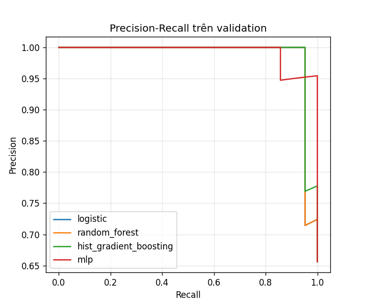

# Slide thuyết trình — Dự báo suy giảm tài chính doanh nghiệp bán lẻ

*Sinh tự động bởi `python -m scripts.make_report`; số liệu luôn khớp `reports/results/`.*

## 1. Đặt vấn đề và câu hỏi nghiên cứu

- Dự báo quý kế tiếp: doanh nghiệp bán lẻ có rơi vào suy giảm tài chính (`is_distressed`)?
- Dữ liệu: 8 chuỗi bán lẻ Mỹ, 332 quý, 324 mẫu
- RQ1 bốn họ mô hình + baseline quy tắc Altman · RQ2 đặc trưng quyết định · RQ3 công ty chưa từng thấy · RQ4 định nghĩa nhãn

## 2. Dữ liệu và cách tạo mẫu

- 16 chỉ tiêu/quý từ SEC XBRL → mẫu = (lịch sử ≤ as_of, quý target, nhãn)
- Chia tập theo thời gian trong từng công ty + dải purge 16 mẫu
- Tái lập bằng 1 lệnh; manifest có SHA-256 cho nguồn và từng split

## 3. Phát hiện then chốt: nhãn là thuộc tính của CÔNG TY

- HD, LOW, WMT có 100% nhãn = 1 trong mọi quý; ROST chỉ 0.047
- Nhãn gốc không khớp quy tắc kế toán đơn giản nào (khớp tối đa 65% nếu bỏ nhóm tín hiệu tổng hợp)
- ⇒ Chỉ số in-domain cao có thể chỉ là “nhớ mặt công ty”

## 4. EDA: chất lượng dữ liệu

- Độ phủ thấp: liabilities, receivables, short_term_investments, net_income (liabilities 39%)
- Nhưng `debt_to_assets`/`debt_to_equity` vẫn phủ 100% nhờ suy ra nợ từ A = L + E
- 32/324 mẫu có <5 quý lịch sử → feature YoY là NaN
- Xử lý: impute trong Pipeline (không rò rỉ) + ablation đo ảnh hưởng

## 5. Tiền xử lý và 47 đặc trưng

- 14 tỷ số (latest + YoY) · 10 tốc độ tăng trưởng · cấu trúc vốn · chỉ báo căng thẳng
- Nhóm `path`: cực trị xấu nhất trong cửa sổ 8 quý, mức giảm so với đỉnh, chuỗi quý âm
- Nợ suy ra từ `A = L + E` ⇒ `debt_to_assets`/`debt_to_equity` phủ 100% mẫu
- Pipeline chính: median-impute → (scaler cho tuyến tính) → model; không ticker one-hot
- Winsorize IQR chỉ nằm ở thí nghiệm 9.1 (lợi ích cho mô hình chốt trong khoảng nhiễu)

## 6. Bốn họ mô hình và tinh chỉnh

- Logistic Regression · Random Forest · HistGradientBoosting · MLP (4 họ, thuần scikit-learn)
- Baseline quy tắc Altman Z'' < 1,1 (không học tham số) + ticker-prior + dummy + 1 chỉ tiêu
- GridSearchCV với StratifiedGroupKFold theo mã cổ phiếu; refit theo AP
- Chọn mô hình: AP cross-company (GroupKFold) → best-F1(val) → AP → AUROC → gap nhỏ nhất
- Mô hình TRIỂN KHAI giữ cấu hình MẶC ĐỊNH (tinh chỉnh chỉ +0,003 CV-AP ⇒ dưới mức nhiễu)

## 7. So sánh có BASELINE — điểm khác biệt của đồ án

- Baseline ticker-prior (không học gì): AUROC = 0.986
- Mô hình được chốt (Random Forest): AUROC = 0.983
- ⇒ Baseline **không hề thua** mô hình ở in-domain (confusion nó khác mô hình: TN/FP/FN/TP = 26/0/6/32 so với 25/1/2/36) ⇒ phần lớn khả năng phân biệt đến từ danh tính công ty

## 8. Metric đầy đủ tại ngưỡng vận hành

- AUROC 0.983 · AP 0.991 · Brier 0.058
- Precision 0.973 · Recall 0.947 · F1 0.960 · macro-F1 0.952
- Kèm bootstrap CI 95% (n = 64) để không overclaim

## 9. Phân tích lỗi: sai số có cấu trúc

- 3/64 mẫu sai = 2 FN + 1 FP (precision 0.973 · recall 0.947)
- Công ty liên quan: DG, FIVE, HD — HD (nhãn hằng = 1) cũng bị bỏ sót 1 quý; nhãn biến động: DG, FIVE
- P(distress) của mẫu sai: 0.174–0.798 ⇒ hạ ngưỡng cứu được 2 FN nhưng trả thêm 1 FP

## 10. Overfitting và lựa chọn mô hình

- AUROC train tới 1.000 nhưng validation 0.965–0.987 ⇒ overfit nhẹ do dữ liệu nhỏ
- Mô hình được chốt: Random Forest — xếp theo AP cross-company 0.958, không theo F1 in-domain
- Learning curve chưa bão hoà ⇒ nút thắt là số lượng công ty

## 11. Đặc trưng quyết định và đa cộng tuyến

- Permutation importance (mô hình RF): `gross_margin_latest`, `receivables_to_sales_latest`, `working_capital_to_assets` dẫn đầu
- ΔAUROC rất nhỏ (max 0.008) ⇒ không có 'cột quyết định'
- Nhiều cột VIF > 10 (33) ⇒ không diễn giải hệ số Logistic như quan hệ nhân quả
- Ablation: bỏ nhóm YoY/tăng trưởng gần như không giảm chất lượng

## 12. Ngưỡng, chi phí và hiệu chuẩn

- Ngưỡng best-F1 0.788 vs ngưỡng tối ưu chi phí 0.783 (FN đắt gấp 5 lần FP)
- Brier ≈ 0,06 ⇒ xác suất dùng được cho bài toán ra quyết định
- Ngưỡng là biến quyết định “miễn phí”: đổi precision/recall, AP không đổi

## 13. Kiểm chứng độ nhạy theo định nghĩa nhãn

- Dựng lại split bằng nhãn quy tắc công khai (`scripts.relabel`)
- Khớp với nhãn gốc chỉ ≈ 74.4% ⇒ hai bộ nhãn khác nhau rõ rệt
- Kết luận “bài toán bị chi phối bởi thực thể” lặp lại trên cả hai định nghĩa nhãn

## 14. Kết luận và hướng phát triển

- Đóng góp: phát hiện + định lượng rò rỉ cấp thực thể; bộ đánh giá chuẩn hoá, tái lập được
- Cross-company AUROC còn 0.933;
- LOCO tính được AUROC trên cả 8/8 công ty (trung bình 0.628)
- Hướng đi: thêm 50–100 công ty, nhãn công khai có cơ sở học thuật, walk-forward/survival
